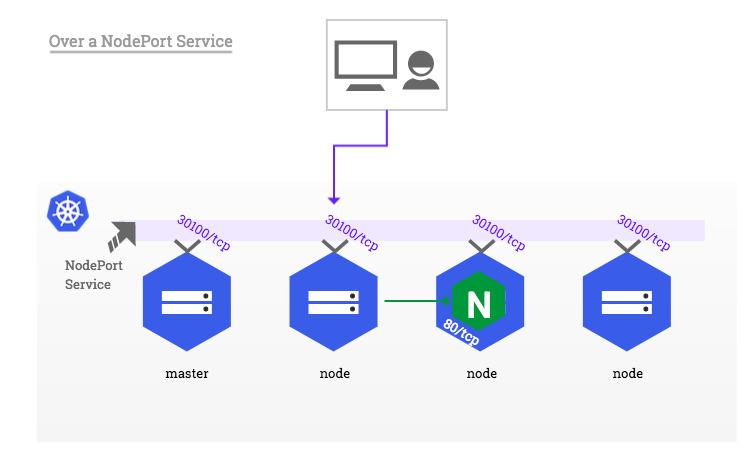

## 基础知识

一般而言，ingress-controller的形式都是一个pod，里面跑着daemon程序和反向代理程序。daemon负责不断监控集群的变化，根据ingress对象生成配置并应用到新配置到反向代理，比如nginx-ingress就是动态生成nigix配置，动态更新upstream，并在需要的时候reload程序应用新配置。

LB是为了把外部的流量转发到集群内，用NodePort也是一样，只要暴露集群的一个访问点给外部，让外部的流量能被转发到集群内的ingress-controller就可以了，甚至ingress-controller用hostNetwork的方式都可以：

## bare-metal部署

https://kubernetes.github.io/ingress-nginx/deploy/baremetal/

在bare-metal环境（非云环境）,没有公有云提供的LoadBalance来负责接收外网的流量，为了方便起见，可以创建一个NodePort类型的Service，它会在所有的k8s node上暴露相同的端口号。

NodePort类型的Service默认会执行源地址转换，这意味着在NGNIX看来，它收到的HTTP请求的源地址都是接收到这个请求的node的ip地址，可以将service的spec中的`externalTrafficPolicy`字段设置为`Local`，来保留源IP地址，但这个设置会导致当node上没有运行nginx ingress controller的时候包被丢掉。

因为 NodePort Service 没有获得一个 LoadBalancerIP， 所以 Ingress 控制器不会更新它管理的Ingress的状态（Ingress是Ingress 控制器管理的？？？）

虽然没有LB为Ingress Controller提供一个公共IP，也可以强制更新Ingress的状态通过设置 `ingress-nginx` Service的 `externalIPs` 字段。

