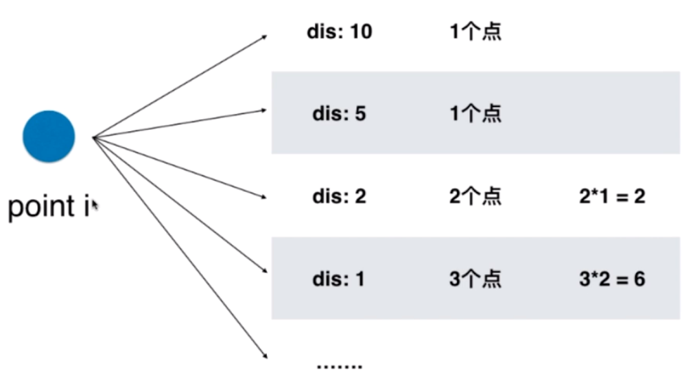

[TOC]

# 算法
## 对碰指针
### leetcode167-在一个有序数组中找到和为N的两个数
### leetcode11-盛最多的水
给你 n 个非负整数 a1，a2，...，an，每个数代表坐标中的一个点 (i, ai) 。在坐标内画 n 条垂直线，垂直线 i 的两个端点分别为 (i, ai) 和 (i, 0)。找出其中的两条线，使得它们与 x 轴共同构成的容器可以容纳最多的水。


## 滑动窗口
### leetcode209-长度最小的子数组
给定一个含有 n 个正整数的数组和一个正整数 s ，找出该数组中满足其和 ≥ s 的长度最小的连续子数组，并返回其长度。如果不存在符合条件的连续子数组，返回 0。

### leetcode3-无重复的最长子串
给定一个字符串，请你找出其中不含有重复字符的 最长子串 的长度。

示例 1:
```
输入: "abcabcbb"
输出: 3 
解释: 因为无重复字符的最长子串是 "abc"，所以其长度为 3。
```

代码：
```java
class Solution {
    public int lengthOfLongestSubstring(String s) {
        int[] freq = new int[256]; // 优化：用一个char数组来记录各个字符出现的频率，从而判断一个字符是否出现过。
        char[] charArr = s.toCharArray();
        int l=0;
        int r=-1;
        int max = 0;
        while(l<charArr.length){
            if(r+1<charArr.length && freq[charArr[r+1]] == 0){
                r++;
                freq[charArr[r]]++;
                if(r-l+1>max) max=r-l+1;
            }else{
                freq[charArr[l]]--;
                l++;
            }
        }
        return max;
    }
}
```

### leetcode76-最小覆盖子串-hard

给你一个字符串 S、一个字符串 T，请在字符串 S 里面找出：包含 T 所有字符的最小子串。

示例：

> 输入: S = "ADOBECODEBANC", T = "ABC"
> 输出: "BANC"


思路:
```txt
/**时间复杂度O(N)，空间复杂度O(1)；  技术：滑动窗口+计数索引（不知道是不是这样叫，可以理解为简单的Hash表实现）
这道题有一定难度，leetcode438 号题也可使用类似的思路，不过稍微简单一些。

1. 注意到题目的关键："所有字母的最小子串"，也就是说两个串都只能是字母。
2. 于是，可以开辟一个大小为64的数组，来存放数组中字母的频率(Frequency)。准确的说，
   通过字母的ASCII码作为数组的索引，开辟空间的大小为26+6+26=58：26个大写字母，26个小写字母，
   还有中间的6个非字母  A~Z[65~90]  非字母[91~96]  a~z[97~122]
3. 滑动窗口的使用：分三种情况来移动窗口：（这里令当前窗口的左右边界分别为l，r，窗口的大小为winSize=r-l+1）
   1) 当winSize < t.size()  r++;  也就是窗口右边界向右移动
   2) 当winSize == t.size() :
	   2.1) 当窗口中的字符已经符合要求了，直接返回return，已经找到了
	   2.2) 否则r++，窗口右边界向右移动
   3) 当winSize > t.size()
	   3.1) 当窗口中的字符已经符合要求了，l++，窗口左边界向右移动
	   3.2) 否则r++，窗口右边界向右移动

4. 上面是滑动窗口的使用思路，具体实现上有一定的不同，下面是需要考虑到的要点：
   1) 啥叫作窗口中的字符已经符合要求了？
   2) 窗口滑动时的操作是关键
   3) 要考虑到数组越界的问题
```

```java

class Solution {
    public String minWindow(String s, String t) {
        char[] sArr = s.toCharArray();
        char[] tArr = t.toCharArray();
        int[] sCount = new int[58];
        int[] tCount = new int[58];

        for(int i=0; i<tArr.length; i++){
            int index = tArr[i] - 'A';
            tCount[index]++;
        }
        
        int minLen = sArr.length + 1;
        char[] result = null;
        int winSize = tArr.length;

        int l=0;
        int r=-1;
        while(l<sArr.length){
            while(true){
                if(r+1<sArr.length){
                    sCount[sArr[++r]-'A']++;
                    if(r-l+1>=winSize && isContain(sCount,tCount)){
                        if(r-l+1<minLen){
                            minLen = r-l+1;
                            result = new char[minLen];
                            for(int k=0;k<minLen;k++){
                                result[k] = sArr[l+k];
                            }
                        }
                        break;
                    }
                }else{
                    break;
                }
            }
            while(true){
                if(l<sArr.length){
                    sCount[sArr[l]-'A']--;
                    l++;
                    if(isContain(sCount,tCount)){
                        if(r-l+1<minLen){
                            minLen = r-l+1;
                            result = new char[minLen];
                            for(int k=0;k<minLen;k++){
                                result[k] = sArr[l+k];
                            }
                        }
                    }else{
                        break;
                    }
                }else{
                    sCount[sArr[l]-'A']--;
                    l++;
                    break;
                }
            }
            
        }

        String sResult = "";
        if(result!=null){
            sResult = String.valueOf(result);
        }

        return sResult;

    }

    private boolean isContain(int[] s, int[] t){
        for(int i=0; i<t.length;i++){
            if(s[i] < t[i]){
                return false;
            }
        }
        return true;
    }
}

```

## 查找表

### leetcode242-有效的异位字符串(anagram)

给定两个字符串 *s* 和 *t* ，编写一个函数来判断 *t* 是否是 *s* 的字母异位词。

示例 1:

> 输入: s = "anagram", t = "nagaram"
> 输出: true

思路：把字符串s各个字符放到Map中，

代码：

```java
class Solution {
    public boolean isAnagram(String s, String t) {
        HashMap<Character,Integer> map1 = new HashMap<>();

        for(Character c : s.toCharArray()){
            map1.put(c,map1.getOrDefault(c,0)+1);
        }

        for(Character c : t.toCharArray()){
            Integer count = map1.get(c);
            if(count == null) return false;
            if(count == 1){
                map1.remove(c);
            }else{
                map1.put(c,count-1);
            }
        }
        return map1.isEmpty();
    }
}
```


### leetcode1-two sum

给定一个整数数组 nums 和一个目标值 target，请你在该数组中找出和为目标值的那 两个 整数，并返回他们的数组下标。你可以假设每种输入只会对应一个答案。但是，数组中同一个元素不能使用两遍。

示例:

> 给定 nums = [2, 7, 11, 15], target = 9
> 因为 nums[0] + nums[1] = 2 + 7 = 9
> 所以返回 [0, 1]


### leetcode454-4Sum II

给定四个包含整数的数组列表 A , B , C , D ,计算有多少个元组 (i, j, k, l) ，使得 A[i] + B[j] + C[k] + D[l] = 0。

为了使问题简单化，所有的 A, B, C, D 具有相同的长度 N，且 0 ≤ N ≤ 500 。所有整数的范围在 -228 到 228 - 1 之间，最终结果不会超过 231 - 1 。

例如:

> 输入:
> A = [ 1, 2]
> B = [-2,-1]
> C = [-1, 2]
> D = [ 0, 2]
>
> 输出:
> 2

思路：题目中提到长度N的范围是小于500的，由此我们大概可以估计算法的复杂度应该是O(n^2)级别的

代码：

```java
class Solution {
    public int fourSumCount(int[] A, int[] B, int[] C, int[] D) {
        HashMap<Integer,Integer> map = new HashMap<>();
        int len = A.length;
        int sum = 0;
        int result = 0;

        // 建立C+D的查找表
        for(int i=0; i<len; i++){
            for(int j=0; j<len; j++){
                sum = C[i] + D[j];
                if(map.containsKey(sum)){
                    map.put(sum,map.get(sum)+1);
                }else{
                    map.put(sum,1);
                }
            }
        }

        for(int i=0; i<len; i++){
            for(int j=0; j<len; j++){
                sum = 0 - A[i] - B[j];
                if(map.containsKey(sum)){
                    result += map.get(sum);
                }
            }
        }
        return result;
    }
}
```


### 447-number-of-boomerangs-simple

给定平面上 n 对不同的点，“回旋镖” 是由点表示的元组 (i, j, k) ，其中 i 和 j 之间的距离和 i 和 k 之间的距离相等（需要考虑元组的顺序）。

找到所有回旋镖的数量。你可以假设 n 最大为 500，所有点的坐标在闭区间 [-10000, 10000] 中。

示例:

> 输入:
> [[0,0],[1,0],[2,0]]
>
> 输出:
> 2
>
> 解释:
> 两个回旋镖为 [[1,0],[0,0],[2,0]] 和 [[1,0],[2,0],[0,0]]

小技巧：如何计算两点的距离？只需要求两个点之间距离的平方就可以，不用求它们之间的真实距离。

思路：

建立第i个节点到其他节点距离的查找表，值为距离相同的节点数，统计节点数大于等于2的表项，**假如距离相同的节点数为n，满足条件的元组数量为n*(n-1)**：



代码：

```java
// O(n^2)
class Solution {
    public int numberOfBoomerangs(int[][] points) {
        int len = points.length;
        int result = 0;
        for(int i=0;i<len;i++){ 
            Map<Integer, Integer> map = new HashMap<>();
            int[] point = points[i]; // 以点i为锚点，建立点i到其他点距离的查找表
            for(int j=0;j<len;j++){
                if(j != i){
                    int distance = dis(point,points[j]);
                    map.put(distance,map.getOrDefault(distance,0)+1);
                }
            }
            for(Integer c : map.values()){
                if(c>=2){
                    result += c*(c-1); // 符合条件的元组
                }
            }
        }
        return result;
    }

    // 两点之间距离（的平方）
    private int dis(int[] point1, int[] point2){
        return (point1[0]-point2[0])*(point1[0]-point2[0]) + (point1[1]-point2[1])*(point1[1]-point2[1]);
    }
}
```


### 149-max points on a line-hard-todo


给定一个二维平面，平面上有 n 个点，求最多有多少个点在同一条直线上。

示例 1:

> 输入: [[1,1],[2,2],[3,3]]
> 输出: 3
> 解释:
> ^
> |
> |        o
> |     o
> |  o  
> +------------->
> 0  1  2  3  4


## 计算x的n次方的优化算法

普通算法：x连乘n次，算法复杂度O(n)
可以用递归的方式，pow(x, n/2)，算法复杂度O(logn)

## f(n)=f(n-1)+f(n-1)的时间复杂度
O(n^2)： 2^0 + 2^1 + 2^2 +2^3 + 2^4 +...2^n