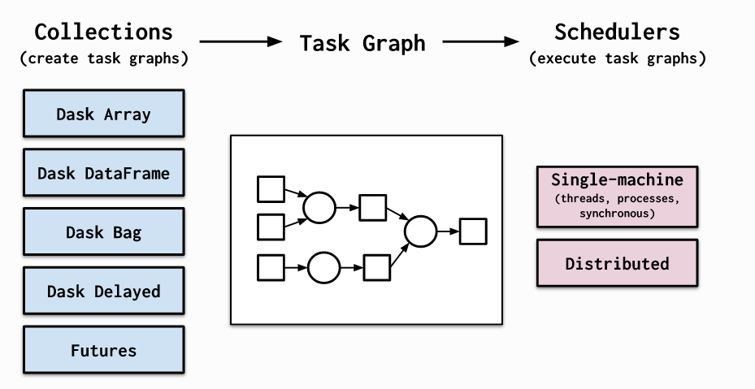

[TOC]

# Get Started

Dask是Python中用于并行计算的一个灵活的库。

Dask由两部分组成:

- 动态任务调度：针对交互式计算工作负载进行了优化
- “大数据”集合：类似于并行数组、dataframes和列表，它们将NumPy、panda或Python迭代器等公共接口扩展到大于内存或分布式环境。这些并行集合运行在动态任务调度程序之上

Dask强调以下美德:

- Familiar：提供并行的NumPy数组和panda DataFrame对象
- Flexible：为更多自定义工作负载和与其他项目的集成提供任务调度接口
- Native：允许使用纯Python进行分布式计算，并访问PyData堆栈
- Fast：操作具有低开销，低延迟，和最小的序列化所需的快速数值算法 
- Scales up：在具有1000个core的集群上弹性地运行
- Scales down： 可以运行在一个只有单核的笔记本电脑上
- Responsive：在设计时考虑了交互式计算，它提供快速的反馈和诊断来帮助人类




## 安装Dask

```shell
conda install dask # 安装dask及其所有依赖
conda install dask-jobqueue -c conda-forge # 安装dask-jobqueue
```

## 设置

Dask有两个任务调度器家族：单机调度器和分布式调度器。

### 单机调度器

默认的Dask调度器通过使用线程或进程在一台机器上提供并行性。这是Dask使用的默认选项，因为它不需要设置。使用此调度器不需要做任何选择或设置。但是，您可以在线程和进程之间进行选择:

- 线程：在同一个进程中使用多个线程。此选项适用于释放GIL(如NumPy、panda、Scikit-Learn、Numba等)的数值代码，因为数据可以自由共享。这也是dask.array, dask.dataframe和dask.delayed的默认调度器

- 进程：将数据发送到单独的进程进行处理。使用进程可以避免GIL问题，但也会导致大量的进程间通信，这可能比较慢。这是dask.bag的默认调度器，但有时候对dask.dataframe也很有用

  在使用GIL（全局锁）时，dask.distributed一般是更好的选择。

- 单线程：在单个线程中执行计算。此选项不提供并行性，但在调试或分析时非常有用。在许多情况下，将并行执行转换为连续执行是一个方便的选择，当希望更好地了解正在发生的事情的时候

通过指定scheduler参数可以显式指定上述3种方式中的某种，3个值分别为：threads、processes和single-threaded。可以用以下三种方式来指定：

```shell
# 1 调用compute()方法时
x.compute(scheduler='threads')
# 2 with
with dask.config.set(scheduler='threads'):
    x.compute()
    y.compute()
# 3 全局配置
dask.config.set(scheduler='threads')
```


### 单机：dask.distributed

dask.distributed调度器在单机上也很好用，有时候会比默认的调度器还好，因为：

- 提供了异步API，尤其是Futures
- 提供一个诊断仪表板，可以提供关于性能和进度的有价值的视图

可以通过 以下方式创建一个dask.distributed调度器：

```shell
from dask.distributed import Client
client = Client() # 在单机上创建一个本地集群，并返回一个连接到该集群的客户端
# 访问http://localhost:8787/status可以看到它的dashboard
```

workers和调度器都创建在一个进程中：

```shell
client = Client(processes=False) # 在释放GIL的场景下性能更好
```

显式创建一个本地集群（将集群的创建和客户端的创建分开）：

```shell
from dask.distributed import Client, LocalCluster
cluster = LocalCluster() # 创建一个本地集群，并启动worker,worker数量和CPU核数相等
client = Client(cluster) # 连上本地集群
cluster.scale(4) # 将集群中的worker增加到4个
```

LocalCluster类的定义：

```shell
classdistributed.deploy.local.LocalCluster(n_workers=None, threads_per_worker=None, processes=True, loop=None, start=None, host=None, ip=None, scheduler_port=0, silence_logs=30, dashboard_address=':8787', worker_dashboard_address=None, diagnostics_port=None, services=None, worker_services=None, service_kwargs=None, asynchronous=False, security=None, protocol=None, blocked_handlers=None, interface=None, worker_class=None, **worker_kwargs)
# 各个参数说明
# n_workers:int 要启动的worker数，默认和CPU核数相等
# processes:bool True:使用多进程 False:使用多线程
# threads_per_worker:int 每个worker的线程数
# scheduler_port:int 调度器的端口，默认是8786, 0表示随机选一个端口
```


### 命令行

这是在多台机器上部署Dask的最基本方法。在生产环境中，此过程通常由其他资源管理器自动执行。因此，很少有人需要明确地遵循这些指示。相反，这些说明对于那些可能希望在其机构内设置自动化服务来部署Dask的IT专业人员非常有用。

一个dask.distributed网络包括了一个dask-scheduler进程和几个连到scheduler上的dask-worker进程。这些是可以从命令行执行的普通Python进程。如下命令在一个节点上启动dask-scheduler：

```shell
# 创建一个scheduler
dask-scheduler --port 30001
Scheduler at: tcp://172.18.213.142:30001

# 创建一个worker，连上scheduler
dask-worker tcp://172.18.213.142:30001
```


# 示例

```shell
import dask.array as da
x = da.random.random((40000, 40000), chunks=(1000, 1000))
da.exp(x).sum().compute()  # 可以查看机器CPU
```

# Scheduling

# Dask-Jobqueue

当启动一个dask_jobqueue的时候，也会自动启动一个dask dashboard。Dask集群生成一个传统的作业脚本，并将其提交到作业队列。可以通过命令print(cluster.job_script())来看到生成的脚本，类似如下：

```shell
#!/usr/bin/env zsh

#PBS -N dask-worker
#PBS -q regular
#PBS -A P48500028
#PBS -l select=1:ncpus=24:mem=100G
#PBS -l walltime=02:00:00

/home/username/path/to/bin/dask-worker tcp://127.0.1.1:43745
--nthreads 4 --nprocs 6 --memory-limit 18.66GB --name dask-worker-3
--death-timeout 60
```

每个作业都被独立地发送到作业队列，一旦该作业启动，一个dask-worker进程将启动并连接到运行的调度器上.如果工作队列很忙，那么worker可能需要一段时间才能通过，或者不是所有worker都到达。在实践中，我们发现，由于dask-jobqueue提交许多小作业，而不是单个大作业，所以worker通常能够相对较快地启动。这将取决于您的集群的作业队列的状态。

当cluster对象消失时，不管是因为您删除它，还是因为您关闭了Python程序，它将向worker发送一个信号，让其关闭。如果由于某种原因这个信号没有通过，那么worker将在等待一个不存在的scheduler 60秒后自杀。

在dask-distributed中，一个Worker是一个python对象，dask Cluster中的节点，用于服务数据和执行计算。Jobs是提交到作业队列系统（PBS等）上并被其管理的资源。在一个Job中可能包含有多个worker。

## 配置

可以将关键字传递给Cluster对象，定义Dask-jobqueue应该如何定义**单个作业**(而不是整个集群)：

```shell
cluster = PBSCluster(
     # Dask-worker specific keywords
     cores=24,             # Number of cores per job 
     memory='100GB',       # Amount of memory per job
     shebang='#!/usr/bin/env zsh',   # Interpreter for your batch script (default is bash)
     processes=6,          # Number of Python processes to cut up each job
     local_directory='$TMPDIR',  # Location to put temporary data if necessary
     # Job scheduler specific keywords
     resource_spec='select=1:ncpus=24:mem=100GB',
     queue='regular',
     project='my-project',
     walltime='02:00:00',
)
```

cores和memory指定的是单个Job的配置，所以不能超过单台机器的大小。

另外，可以使用scale方法来指定要运行多少作业：

```shell
cluster.scale(jobs=2)  # launch 2 workers, each of which starts 6 worker processes
cluster.scale(cores=48)  # Or specify cores or memory directly
cluster.scale(memory="200 GB")  # Or specify cores or memory directly
```

每次向集群构造函数指定所有参数都可能出错,特别是在与新用户共享此工作流时。相反，我们建议使用如下配置文件(默认保持在~/.config/dask/目录下):

```shell
# jobqueue.yaml file
jobqueue:
  pbs:
    cores: 24
    memory: 100GB
    processes: 6
    shebang: "#!/usr/bin/env zsh"

    interface: ib0
    local-directory: $TMPDIR

    resource-spec: "select=1:ncpus=24:mem=100GB"
    queue: regular
    project: my-project
    walltime: 00:30:00
```

当创建cluster时不显式指定参数时（如cluster = PBSCluster()），则会使用上述默认配置。如果把配置文件放在/etc/dask目录下，则会对所有用户生效。

## slurm

```shell
from dask_jobqueue import SLURMCluster

cluster = SLURMCluster(cores=12,
                       processes=1,
                       memory="100G",
                       project="woodshole",
                       walltime="01:00:00",
                       queue="debug")
                       
# 每个进程的线程数 
```


# Kubernetes

## 安装Dask

通过relm:

```shell
helm repo add dask https://helm.dask.org/    # add the Dask Helm chart repository
helm repo update                             # get latest Helm charts
helm install dask/dask                     # deploy standard Dask chart
```


# API文档

## 命令行

### dask-scheduler

```shell
dask-scheduler [OPTIONS] [PRELOAD_ARGV]...
# OPTIONS
--host <host> # URL,IP或主机名
--port <port> # 监听端口，默认是8786
--interface <interface> # 监听的网卡名
--protocol <protocol> # 协议，如tcp,tls,ucx，默认是tcp
--dashboard-address <dashboard_address> # dashboard的端口，默认8787
--dashboard, --no-dashboard # 启动/不启动dashboard，默认是启动
```


### dask-worker

```sh
dask-worker [OPTIONS] [SCHEDULER] [PRELOAD_ARGV]...
# Options
--worker-port <worker_port> # 提供计算服务的端口，默认是随机
--nanny-port <nanny_port> # 
--dashboard-address <dashboard_address> # dashborad端口，默认是随机
--dashboard, --no-dashboard # 启动/不启动dashboard，默认是启动
--listen-address <listen_address> # worker绑定的地址，如tcp://0.0.0.0:9000
--nthreads <nthreads> # 每个进程的线程数
--nprocs <nprocs> # worker启动的进程数
--name <name> # worker的名字
--memory-limit <memory_limit> # 每个进程使用的内存，单位的byte，也可以显式使用单位，如：5G,500M，默认的auto
--resources <resources> # 任务使用的资源限制，如GPU=2 MEM=10e9
--scheduler-file <scheduler_file> # 指定调度信息保存的文件
```

### dask-ssh

通过ssh启动一个dask集群。

```shell
dask-ssh [OPTIONS] [HOSTNAMES]... # hostnames的第一个是scheduler，后面的是worker
# Optional
--scheduler <scheduler> # 手动指定scheduler，默认是hostname第一个地址
--scheduler-port <scheduler_port> # 指定scheduler端口，默认是8786
--nthreads <nthreads> # 指定每个worker的线程数，默认为CPU核数除以每个主机的进程数
--nprocs <nprocs> # 每个主机的worker数，默认为1
--hostfile <hostfile> # 从文件中读入HOSTNAMES列表
--ssh-username <ssh_username> # ssh用户名
--ssh-port <ssh_port> # ssh端口
--ssh-private-key <ssh_private_key> # ssh密钥
--memory-limit <memory_limit> # worker的内存限制
```

### SLURMCluster

常用方法：

```shell
cluster = SLURMCluster()
cluster.scale(5) # 扩展worker节点到5
```


## Python接口

### SSHCluster

使用SSH部署一个Dask集群

```shell
distributed.deploy.ssh.SSHCluster(hosts: List[str] = None, connect_options: dict = {}, worker_options: dict = {}, scheduler_options: dict = {}, worker_module: str = 'distributed.cli.dask_worker', **kwargs)
# 参数
hosts: List[str] # 主机名或IP的列表，第一个元素用于scheduler，后面的用于worker，scheduler和worker可以部署在同一个机器上
connect_options: dict # 可选字段，设置传给asyncssh.connect的关键字，参考asyncssh.connect
worker_options: dict # 可选字段，设置传给worker的关键字，参考dask.distributed.Worker
scheduler_options: dict # 可选字段，设置传给scheduler的关键字，参考dask.distributed.Scheduler

```

例子：

```shell
>>> from dask.distributed import Client, SSHCluster
>>> cluster = SSHCluster(
...     ["localhost", "localhost", "localhost", "localhost"],
...     connect_options={"known_hosts": None},
...     worker_options={"nthreads": 2},
...     scheduler_options={"port": 0, "dashboard_address": ":8797"}
... )
>>> client = Client(cluster)
```


### Array

Dask数组使用阻塞算法实现NumPy ndarray接口的一个子集，把大的数组分割成许多小的数组。这使我们能够使用所有CPU核在大于内存的数组上进行计算。我们使用Dask图来协调这些被阻塞的算法。

Dask数组协调许多排列成网格的NumPy数组。这些NumPy数组可能位于磁盘或其他机器上:


Dask Array应用于大气和海洋科学、大规模成像、基因组学、优化或统计的数值算法等领域。

常用接口：

```shell
exp(x) # 返回e的x次方
random.random([size]) # 产生区间为[0.0, 1.0)的随机浮点数
```


