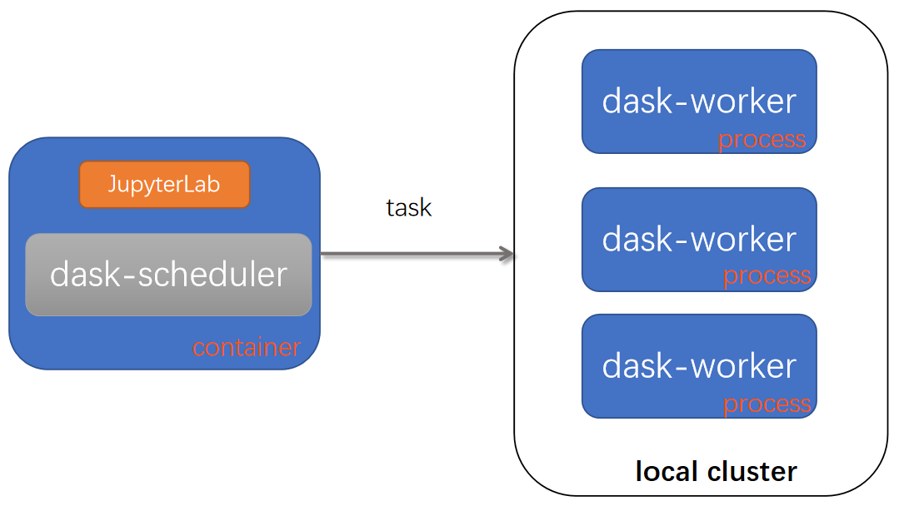

[TOC]

# Dask总结

## Get Started

dask's helloworld:

```shell
import dask.array as da
x = da.random.random((100000, 100000), chunks=(1000, 1000)) # 产生一个100000*100000的浮点数数组，约80G
da.exp(x).sum().compute() # exp:计算e的x次幂 sum:数组求和 
						# 在12核120G的星光作业上运行约20s，1核2G的虚拟机上跑要6m16s
```

默认使用的是单机的scheduler，在一个进程中使用多线程进行计算。

### 使用分布式的scheduler

```shell
from dask.distributed import Client, LocalCluster
cluster = LocalCluster(n_workers=10)
client = Client(cluster)

# 参数
# n_workers : 启动几个worker
# processes : 是否使用多个worker,默认为True
# threads_per_worker : 每个worker的线程数

x = da.random.random((100000, 100000), chunks=(1000, 1000))
da.exp(x).sum().compute() # 在12核120G的星光作业上运行约50s
```

### 使用slurm集群

```shell
from dask_jobqueue import SLURMCluster
cluster = SLURMCluster(cores=2,
                       processes=1,
                       memory="20GB",
                       project="woodshole",
                       walltime="01:00:00",
                       queue="debug")
# cores : 单个job使用的CPU数
# memory : 单个job使用的内存
# processes : 默认每个job使用1个线程
# queue : 分区名

scontrol show node
# scontrol show partition
squeue
sinfo
cluster.scale(5) # 扩展worker节点到5,每个worker会创建一个进程来执行任务
                 # ps -ef | grep worker_pid

from dask.distributed import Client
client = Client(cluster)

x = da.random.random((100000, 100000), chunks=(1000, 1000))
da.exp(x).sum().compute() # 约50s
```


查看slurm运行中的作业列表：


### 使用pangeo的xarray调度dask

```shell
import xarray as xr
import xarray.ufuncs as xu
xdarray = xr.DataArray(x, dims=('x','y'))
ds = xdarray.to_dataset(name="foo")

# 创建slurm集群
from dask_jobqueue import SLURMCluster
cluster = SLURMCluster(cores=2,
                       processes=1,
                       memory="1G",
                       project="woodshole",
                       walltime="01:00:00",
                       queue="debug")
cluster.scale(5)
client = Client(cluster)

result = xu.exp(ds).sum().persist() # 执行计算，需要注意的是这是个异步操作，会马上返回
result.load() # 查看计算结果
```


 ## 架构

LocalCluster



Kubernetes


Slurm

