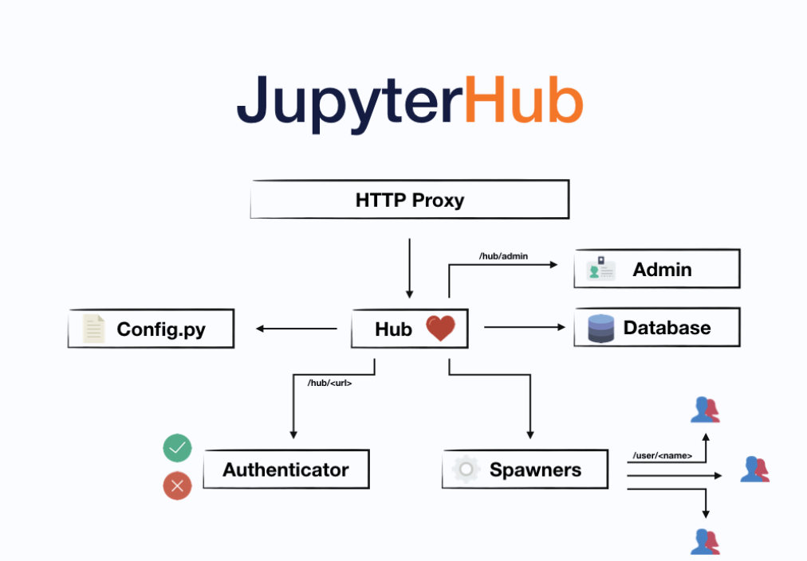

[TOC]

# 部署安装


## Jupyter NoteBook安装

```shell
# 安装python3

# 安装conda
wget https://repo.anaconda.com/miniconda/Miniconda3-latest-Linux-x86_64.sh
bash Miniconda3-latest-Linux-x86_64.sh

# 安装notebook
conda install -c conda-forge notebook
jupyter notebook --allow-root --ip 172.16.108.133 # 运行jupyter,启动notebook服务器，默认监听的ip地址是localhost
# 出现类似如下输出则表示运行成功
[root@sz-01 ~]# jupyter notebook --ip 172.18.213.142  --allow-root
[I 10:58:06.047 NotebookApp] Serving notebooks from local directory: /root
[I 10:58:06.048 NotebookApp] The Jupyter Notebook is running at:
[I 10:58:06.048 NotebookApp] http://172.18.213.142:8888/?token=9c85c8c222f9c2fbe9c3946cab899ecddb14546994a04b84
[I 10:58:06.048 NotebookApp]  or http://127.0.0.1:8888/?token=9c85c8c222f9c2fbe9c3946cab899ecddb14546994a04b84
[I 10:58:06.048 NotebookApp] Use Control-C to stop this server and shut down all kernels (twice to skip confirmation).
[W 10:58:06.054 NotebookApp] No web browser found: could not locate runnable browser.
[C 10:58:06.054 NotebookApp] 
    
    To access the notebook, open this file in a browser:
        file:///root/.local/share/jupyter/runtime/nbserver-4532-open.html
    Or copy and paste one of these URLs:
        http://172.18.213.142:8888/?token=9c85c8c222f9c2fbe9c3946cab899ecddb14546994a04b84
     or http://127.0.0.1:8888/?token=9c85c8c222f9c2fbe9c3946cab899ecddb14546994a04b84
# 按照提示用浏览器打开
```

## JupyterLab安装
```shell
# 安装python3
# 安装conda
# 安装jupyterlab，安装完要重新打开一个终端
conda install -c conda-forge jupyterlab
# 运行jupyterlab
jupyter lab --allow-root --ip 192.168.23.130
```

## 使用Docker部署用于测试的JupyterHub

```shell

# 不推荐在生产上使用这种方式部署
# 1 安装Docker 1.12以上版本

# 2 生成自签名的ssl证书
# openssl req -x509 -nodes -days 365 -newkey rsa:2048 -keyout mykey.key -out mycert.pem
openssl req -x509 -nodes -days 365 -newkey rsa:2048 -keyout jupyterhub.key -out jupyterhub.crt
mkdir -p secrets
cp jupyterhub.crt jupyterhub.key secrets/

# 3 创建GitHub OAuth APP

# 4 把GitHub OAuth Client ID, Client Secret and OAuth callback url传给jupyterhub运行时
cd secrets/
vim oauth.env
cat oauth.env
GITHUB_CLIENT_ID=5baa9ff5d43d136482c3
GITHUB_CLIENT_SECRET=6f0a066ee230c708446aab12552673d67351fa2c
OAUTH_CALLBACK_URL=https://47.113.94.144/hub/oauth_callback

vim userlist
cat userlist
huangxinxin-szu admin

```


# 常用命令

```shell
jupyter notebook # 启动一个notebook服务器
                 # --help 查看帮助
                 # --no-browser 创建完notebook服务器后不要用浏览器打开
                 # --port 指定端口
                 # --ip 指定监听的地址
```


# 知识点

`ipython`是一个`python`的交互式`shell`，比默认的`python shell`好用得多。作为Jupiter notebook的一个REPL

REPL：Read-Eval-Print-Loop，提示用户输入代码，用户输入后，执行该代码，循环该过程

IPython Kernel是一个独立的进程用于运行用户的代码，以及计算可能完成的任务。notebook或qt console等前端通过Json消息与IPython内核通信，Json信息通过ZeroMQ socket发送。一个内核进程可以让多个前端连接，

Jupyter Notebook及其灵活的接口将Notebook从代码扩展到可视化、多媒体、协作等等。除了运行代码之外，它还将代码和输出以及markdown注释存储在一个称为notebook的可编辑文档中，当保存这个文档时，它会被发送到notebook服务器上，服务器会把它保存为一个.ipynb的json文件。注意是notebook server负责保存和加载notebooks，而不是ipython内核，内核只是简单地获取代码并执行。jupyter的Nbconvert工具可以把notebook转换成其它格式，如xml。

jupyterhub/jupyterhub镜像只包含了hub服务。
/srv/jupyterhub用于存放安全和运行时文件
/etc/jupyterhub用于存放配置文件。
JupyterHub默认使用PAM方式使用用户名和密码来认证系统用户。

Jupyter不提供多用户支持，JupyterHub在Jupyter的基础上增加了多用户的支持。


## URLs

```shell
# 文件浏览
http(s)://<server:port>/<lab-location>/lab/tree/path/to/notebook.ipynb
```


## IPython

IPython3.x中包括了notebook server,qt console等等，是最完整的一个release。在IPython4.x中，与语言无关的部分，如notebook格式，消息协议，qtconsole，notebook web应用等，都移到了一个新的项目中去，并命名为Jupyter。IPython则专注于交互式的Python，其中一部分为jupyter提供了一个Python内核。


## Jupyter NoteBook

Jupyter有很多子项目，如notebook，console，qtconsole等。

Jupyter Notebook包含两个组件：

- 一个web应用：一个基于浏览器的工具，用于交互式创作文档
- notebook文档：.ipynb包含了web应用上的所有可见内容，包括输入输出，解释性文本，数学运算，图片等。

web应用的主要特征：

- 在浏览器上编辑代码，有自动的语法高亮，缩进，补全等
- 使用富媒体（如html）来展示运算结果

notebook文档：


## 架构图

### Jupyter 


### JupyterHub



```

```