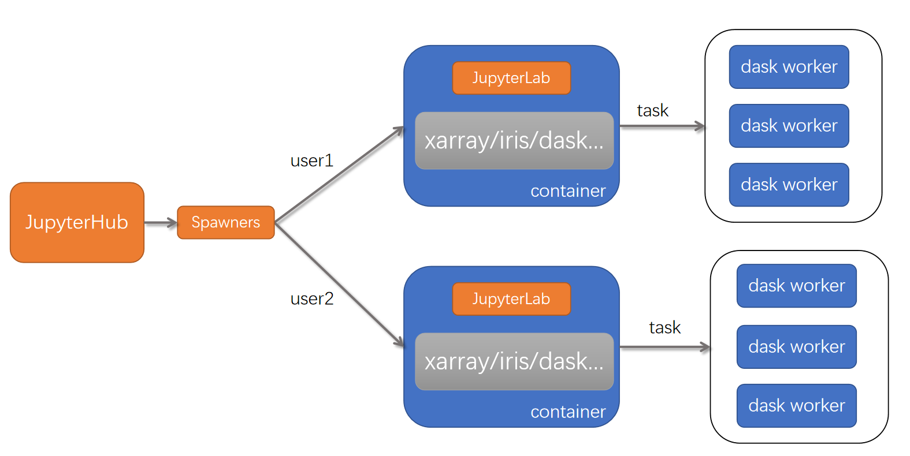

[TOC]


# 使用relm部署


```shell
# pangeo需要用到一个pv,手动用本地目录做有一个pv的话要记得设置好该目录的权限
cat pv02.yaml
apiVersion: v1
kind: PersistentVolume
metadata:
  name: pv002
  labels:
    name: pv002
spec:
  hostPath:
    path: /k8s/pv/pv02
  accessModes: ["ReadWriteMany","ReadWriteOnce","ReadOnlyMany"]
  capacity:
    storage: 1Gi

kubectl apply -f pv02.yaml

helm repo add pangeo https://pangeo-data.github.io/helm-chart/
helm install pangeo/pangeo --version=19.03.05 --name=pangeo --namespace=pangeo  -f values.yaml 

NAME:   pangeo
LAST DEPLOYED: Wed Feb 26 17:53:06 2020
NAMESPACE: pangeo
STATUS: DEPLOYED

RESOURCES:
==> v1/ClusterRole
NAME                                 AGE
pangeo-user-scheduler-complementary  1s

==> v1/ClusterRoleBinding
NAME                                 AGE
pangeo-user-scheduler-base           1s
pangeo-user-scheduler-complementary  1s

==> v1/ConfigMap
NAME            AGE
hub-config      1s
user-scheduler  1s

==> v1/Deployment
NAME            AGE
hub             1s
proxy           1s
user-scheduler  1s

==> v1/PersistentVolumeClaim
NAME        AGE
hub-db-dir  1s

==> v1/Pod(related)
NAME                            AGE
hub-666d68968-dt6zm             0s
proxy-7d48cb9455-ds2v5          0s
user-placeholder-0              0s
user-placeholder-1              0s
user-scheduler-c9bbc864b-28lvx  0s
user-scheduler-c9bbc864b-4cz2m  0s

==> v1/Role
NAME  AGE
hub   1s

==> v1/RoleBinding
NAME  AGE
hub   1s

==> v1/Secret
NAME        AGE
hub-secret  1s

==> v1/Service
NAME          AGE
hub           1s
proxy-api     1s
proxy-public  1s

==> v1/ServiceAccount
NAME            AGE
daskkubernetes  1s
hub             1s
user-scheduler  1s

==> v1/StatefulSet
NAME              AGE
user-placeholder  0s

==> v1beta1/PodDisruptionBudget
NAME              AGE
hub               1s
proxy             1s
user-placeholder  1s
user-scheduler    1s

==> v1beta1/Role
NAME            AGE
daskkubernetes  1s

==> v1beta1/RoleBinding
NAME            AGE
daskkubernetes  1s


NOTES:
Pangeo
------

Thank you for installing Pangeo!

Your release is named pangeo and installed into the namespace pangeo.


Jupyter Hub
-----------

You can find if the hub and proxy is ready by doing:

 kubectl --namespace=pangeo get pod

and watching for both those pods to be in status 'Ready'.

You can find the public IP of the JupyterHub by doing:

 kubectl --namespace=pangeo get svc proxy-public

It might take a few minutes for it to appear!


Support
-------

Note that this is still an alpha release! If you have questions, feel free to file issues at https://github.com/pangeo-data/pangeo/issues.

# 可能需要手动下载镜像：
# gcr.io/google_containers/kube-scheduler-amd64:v1.11.2
# jupyterhub/configurable-http-proxy:3.0.0
```

把LoadBalancer服务改成NodePort类型：

```shell
kubectl edit svc -n pangeo proxy-public
```

创建一个10Gi以上的pv(注意要有写权限):

```shell
cat filesystem01.yaml
apiVersion: v1
kind: PersistentVolume
metadata:
  name: filesystem01
  labels:
    name: filesystem01
spec:
  hostPath:
    path: /k8s/pv/filesystem01
  accessModes: ["ReadWriteMany","ReadWriteOnce","ReadOnlyMany"]
  capacity:
    storage: 1Gi
[root@zjk-01 pv]# cat filesystem02.yaml
apiVersion: v1
kind: PersistentVolume
metadata:
  name: filesystem02
  labels:
    name: filesystem02
spec:
  hostPath:
    path: /k8s/pv/filesystem02
  accessModes: ["ReadWriteMany","ReadWriteOnce","ReadOnlyMany"]
  capacity:
    storage: 10Gi
    
kubectl apply -f filesystem02.yaml
```

使用浏览器访问，输入IP和端口地址即可。在启动服务时会在k8s上起一个pod，可能需要手动拉以下镜像：

```shell
jupyterhub/k8s-network-tools:0.8.0
pangeo/base-notebook:2019.09.23
```


## 需要拉取的镜像

```shell
jupyterhub/k8s-network-tools:0.8.0
pangeo/base-notebook:2019.09.23
```


# 单独跑Jupyter NoteBook（JupyterLab）

为jupyter创建一个NodePort类型的服务，直接访问jupyter

kubectl expose pod jupyter-aaa --port=8888 --type=NodePort --target-port=8888 --name=jupyter -n pangeo

kubectl expose pod jupyter-aaa1 --port=8888 --type=NodePort --target-port=8888 --name=jupyter1 -n pangeo

port是创建的server的端口，target-port是容器的端口


# Pangeo简介

## 简介

Pangeo是一个由许多开发者合作开发软件和基础设施，以支持大数据地球科学（geoscience）研究的社区。

## 目标

- 培育一个生态系统，在这个生态系统中，下一代用于海洋、大气和气候科学的开源分析工具可以被开发、分发和持续使用。这些工具必须是可扩展的，以满足当前和未来的大数据挑战。
- 围绕海洋/大气/陆地/气候科学的开源科学python生态系统促进合作
- 支持特定领域的地球科学包的开发
- 改进这些工具的可伸缩性，以便在HPC和云平台上处理pb级的数据集

总结：Pangeo是一个生态系统，上面已经有许多用于地球科学领域的工具（大部分是Python包），并支持开发者将开发出来的工具共享到这个生态系统上。

Use Case.

总结：作用就是用于地理科学数据的分析处理和可视化。

## Pangeo项目的架构


## JupyterHub的架构


## Pangeo架构



Spawners出来的是一个JupyterLab（阿里云上的Pangeo环境可以看到它的各个组件）。

## JupyterLab

 核心的包：

- Xarray：处理带标签的多维数据的一个工具（基于numpy和pandas）

- Iris：分析和可视化气象和海洋数据集

- Dask：一个用于分析的灵活的并行计算库

- Jupyter：提供一个交互计算的界面


地理科学（Geosciences）：

- [x] climpred：分析初始动态预报模型输出的程序包，范围从短期天气预报到十年气候预报
- [x] pyinterp：为插值地球科学领域中使用的地理参考数据提供工具
- [x] regionmask：绘制和创建空间区域的掩码（mask）
- [x] SatPy：用于读取和操作气象遥感数据并将其写入各种图像和数据文件格式的库
- [x] windspharm：球面调和风分析
- [x] xesmf：地理空间数据的通用Regridder
- [x] xgcm：扩展xarray数据模型以理解有限体积的网格单元(在一般循环模型中很常见)，并为这些网格提供插值和差分操作
. . . 

## 星光应用

## 用户需求？


