[TOC]

## Abstract 

虚拟化技术Docker的出现增加了跨多个主机连接其容器的需求。overlay网络通过抽象物理网络来解决静态网络配置问题。我的研究调查了Docker overlay网络libnetwork，Flannel和Weave在GÉANT Testbed Service (GTS) 上的性能。之前的研究表明，**overlay网络的UDP吞吐量明显低于VM的吞吐量，而其TCP吞吐量甚至部分优于VM**。我将演示这种意外的行为是由VXLAN封装开销和硬件offload的综合影响造成的，**硬件offload对TCP吞吐量的影响比对UDP吞吐量的影响更大**。

此外，我检查了Weave的多跳路由特性的性能，发现该特性不会带来任何延迟损失。UDP吞吐量只会随着每一跳的增加而略微下降，而TCP吞吐量在第一跳之后会急剧下降。

## 1 引言

Docker是一个开源软件，允许在软件容器中部署应用程序。尽管软件容器的技术在Docker出现之前就已经存在了，它太复杂了，无法大规模应用这项技术。Docker的出现极大地促进了软件容器的使用，这使得它们成为比传统虚拟化的更高效、更受欢迎的替代品。由于Docker容器的广泛应用，将它们连接到网络中的需要便应运而生。不同主机之间的连接是通过网络overlay来实现的，可以用不同的方式实现。最近Docker的本地网络库libnetwork的引入允许第三方解决方案与Docker容器集成。目前，最商业化和社区支持的第三方解决方案是Weave和Flannel。

尽管有对Docker容器与传统虚拟机之间的性能差异有大量的研究，关于Docker overlay networks的性能的研究几乎没有。2016年2月，Hermans和de Niet在他们的研究项目“Docker overlay网络—高延迟网络的性能分析”中考察了不同Docker overlay解决方案的性能。我的研究继续和扩展了Hermans & de Niet的研究，并进一步研究了overlay解决方案libnetwork、Weave和Flannel的性能。本研究的主要问题是：

> Docker overlay网络解决方案libnetwork、Weave和Flannel的性能如何？

这个问题可以被分成更精确的子问题，在这个项目中回答。之前的研究表明，所有overlay网络解决方案的UDP吞吐量都显著低于VM的吞吐量。这种差异在TCP吞吐量上无法观察到。这种意想不到的行为引出了第一个子问题：

> 为什么Docker overlay解决方案的UDP吞吐量比TCP低这么多

此外，还需要研究更复杂的应用程序通信场景.Hermans和de Niet深入研究了不同overlay解决方案在点对点连接和星型拓扑网络中的性能，在星型拓扑中，中心节点受到越来越多并发会话的压力。这两种拓扑的结果需要用更复杂的场景来补充。Weave的一个其他overlay网络不支持的特性是跳转路由。这就引出了第二个研究问题:

> 关于吞吐量和延迟，Weave的跳转路由特性的性能如何

## 2 相关工作

过去，对Docker容器性能的不同方面已经进行了研究。这些研究主要集中在传统虚拟机与容器的区别上。Scheepers[13]比较了基于管理程序和基于容器的虚拟化。他得出结论,基于管理程序的虚拟化,比如XEN,更适合应用要求均匀分布的资源,不应该受到相同的系统上执行其他任务的影响，而基于容器的虚拟化,Linux等容器(LXC),更适用于有效利用资源。Morabito[11]也比较了这两种虚拟化技术，得到了相同的结果。

Claassen[1]检查了内核模块veth、macvlan和ipvlan的性能，这些模块连接同一主机上的容器并将它们链接到网络。他得出结论，桥接模式的macvlan是单主机部署中最高效的模块。在一个交换机的环境中，macvlan和veth表现得一样好。由于稳定性问题，ipvlan还不能用于生产，Claassen还尝试了各种overlay网络解决方案，但注意到它们还不够成熟，无法进行测试。

虽然Docker容器是一个被广泛研究的主题，但是对Docker覆盖网络的研究却很少。缺乏研究的主要原因是这些解决方案仍然是相当新的。此外，由于现有覆盖解决方案的快速开发和Docker的本地网络库libnetwork的最新引入，大多数性能分析已经过时。

最近，Hermans和de Niet[3]研究了libnetwork和第三方覆盖网络的可用性和性能。根据他们的经验，Weave是最容易部署的，因为它不需要像libnetwork和Flannel那样的键值存储，需要单独安装，这样设置覆盖网络就更复杂了。这一特性使Weave特别适合敏捷开发和快速原型开发。

尽管这三种解决方案使用非常不同的方法来实现包的路由，但是点到点测量显示在延迟和抖动方面没有显著的差异。与不运行Docker的VM相比，overlay网络在延迟和抖动方面的增加可以忽略不计。然而，对TCP和UDP吞吐量的检查产生了意想不到的结果。iperf的测量结果表明，一些overlay网络的TCP吞吐量甚至比虚拟机还要高。此外，overlay的UDP吞吐量仅为虚拟机吞吐量的50%。结果如图1所示。第一个研究问题旨在调查这种意想不到的行为。

此外，Hermans和de Niet通过越来越多的客户端流媒体文件给一个中心节点施压，研究了overlay网络在星型拓扑中的性能。该流场景的结果表明，覆盖网络的延迟和抖动非常相似，与虚拟机的延迟和抖动没有显著差异。此外，9个并发会话的抖动只有2毫秒，远远低于Cisco为视频流定义的30毫秒的临界限制。

## 3 理论背景

### 3.1 Docker平台

Docker是一个开源平台，它旨在通过所谓的软件容器的操作系统级虚拟化来改进应用程序部署过程。这种技术在Docker出现之前就已经存在了，但是Docker设法以一种更实用的方式实现了它，这是它成功的关键。

应用程序运行所需的所有依赖项都包含在Docker容器中，从而使其独立于所运行的环境。这极大地提高了应用程序的可移植性，因为它可以很容易地部署在不同类型的机器上，比如本地主机、物理和虚拟机以及云平台。

ocker容器由Docker引擎管理，它利用内核的容器化特性cgroups和namespaces来隔离应用程序。它直接运行在主机的内核上。因此，运行Docker容器既不需要管理程序，也不需要来宾操作系统。这两种体系结构方法之间的差异可以在图2中看到。

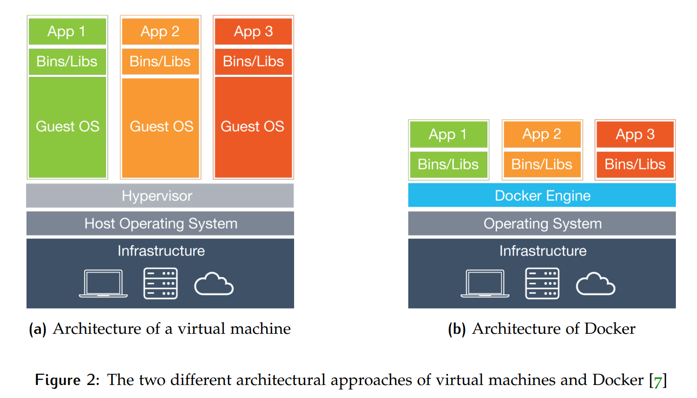

从图中可以看出，Docker容器的运行开销要低得多。此外，Docker容器非常轻量级，因为它们只包含应用程序运行所必需的文件。这些特性使得dockerized应用程序非常灵活和可伸缩，因为它们可以很容易地部署和更新。

Docker容器是从称为映像的只读模板运行的。这些图像由不同的层组成，这些层描述了对前一层所做的更改。这些层可以很容易地添加、修改或删除，而不需要重建整个镜像。在内部，层是由高级多层文件系统(aufs)实现的，它允许透明地覆盖不同文件系统的文件和目录。

Images can either be pulled from the Docker Hub, a centralized repository which holds a
large collection of official images, or created by writing a Dockerfile. Such a file lists all the
instructions that are used expand a base image. Each instruction adds another layer to the
image. These instructions include running commands, adding files and directories and defining
which processes should be started when launching a container of that image. Once a container
is launched from that image, a thin writable layer is created, which allows to write changes to
the container while it is running. These changes can then be committed to create an updated
image which can then be used to create exact replicates of the current container [6]. 

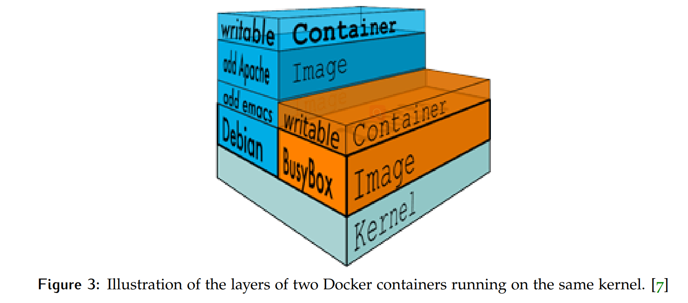

如图3所示，Docker容器运行在同一个内核上，这允许开发人员在一个工作站上构建整个多层应用程序，而不需要传统虚拟化引入的多个操作系统映像的开销。名为docker0的虚拟桥接器处理容器和主机之间的通信。它从私有IP范围连接到子网，每个运行的容器通过虚拟以太网(veth)接口连接到这个子网。在容器中，这个接口通常作为常规的eth0接口出现。由于在同一主机上运行的所有容器都通过docker0桥由同一子网连接，因此它们可以彼此通信。

### 3.2 Docker Overlay网络

容器和外部机器之间的通信由本地主机处理，本地主机使用网络地址转换(NAT)将流量转发到外部机器。因此，通过默认的Docker网络可以很容易地将流量从容器定向到外部服务器。**在Docker 1.9发布之前，启动从外部机器到容器的连接需要一些额外的配置，这些配置将端口静态地映射到特定的容器**。在不同主机上建立容器之间的连接是一项复杂的任务，由此产生的网络非常不灵活。

overlay网络通过抽象物理网络来解决静态网络配置问题。这种抽象允许在未与底层网络的硬件基础设施耦合的端点之间动态创建逻辑链接。通过在不同主机上运行的容器之间建立Overlay网络把IP地址分配给每个容器。因此，容器不再由端口号静态链接，它们可以独立于主机IP地址和位置彼此连接。

#### 3.2.1 Libnetwork 

2015年3月，小型初创企业SocketPlane加入了Docker团队，该公司致力于通过系统定义网络(system-defined networking, SDN)实现Docker容器之间的多主机联网。**他们的方法是将容器连接到一个开放的vSwitch (OVS)端口，而不是虚拟桥**。从Docker 1.9版本开始，SocketPlane的解决方案就包含在Docker的本地网络库libnetwork的主版本中，该库包含了所有Docker的网络代码。这种模块化方法遵循Docker开发小型、高度模块化和可组合工具的哲学，允许本地和远程驱动程序为容器提供网络。

Libnetwork实现了容器网络模型(CNM)，该模型允许像独立主机一样处理容器。

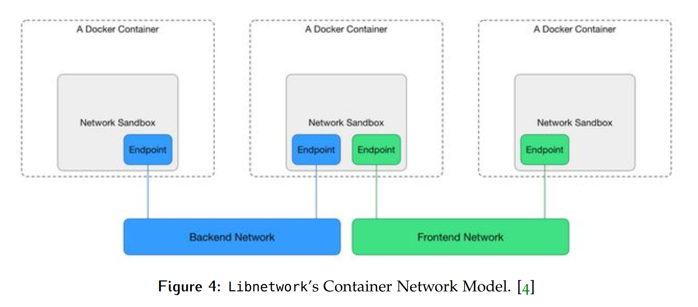

如图4所示，CNM由三个主要组件组成:沙箱、端点和网络。沙箱包含容器的网络堆栈配置，如容器的接口、路由表和DNS设置。端点将沙箱连接到网络。沙箱可以有多个连接到多个网络的端点(参见图4中的中间容器)。例如，可以将此类端点实现为veth接口或OVS内部端口。一组能够直接通信的端点正在形成一个网络。网络的实现可以是Linux网桥或VXLAN段。

CNM的驱动对象抽象了网络的实际实现并负责管理它。有两种不同类型的驱动程序对象:内置驱动程序和远程驱动程序。内置的桥接驱动程序连接同一主机上的容器。在安装Docker时，docker0桥是默认创建的，Docker会自动创建一个子网和这个网络的网关。当运行容器时，Docker自动将它们连接到这个网络。由于历史原因，Docker安装所需的默认主机和无网络也是内置网络。然而，它们不是用来交互的，因此没有进一步的详细解释。

至于Docker本身，默认的桥接网络docker0容易出错，最好由用户定义的网络代替。可以在同一台主机上创建多个用户定义的网络。容器只能在网络中通信，而不能跨网络通信。在创建用户定义的网络之后，需要在启动时显式地将容器连接到它。用户定义的桥接网络与外部网络隔离，不能连接。但是，通过公开容器端口，可以将桥接网络的一部分提供给外部网络。

跨不同主机连接容器的网络由覆盖网络驱动程序管理，它支持开箱即用的多主机网络。该驱动程序是基于网络虚拟化技术的虚拟可扩展局域网(VXLAN)。Overlay网络驱动程序需要一个键值(KV)存储，它存储所有参与主机的信息。在撰写本文时，Libnetwork支持KV-stores Consul 、Etcd和ZooKeeper。在每个主机上设置到KV-store的连接后，可以创建Docker覆盖网络。就像网桥一样，启动的容器需要明确地连接到覆盖网络。覆盖网络上的每个容器都有自己的虚拟接口，可以直接与覆盖网络中其他主机上的容器通信。

#### 3.2.2 Weave

Docker还支持远程网络驱动程序，允许第三方提供商通过插件机制注册libnetwork。Weave就是这样一个插件.Weave Overlay网络由放置在Docker容器中的几个软件路由器组成。每个参与Overlay网络的机器都需要这样一个Weave路由器容器。**Weave路由器建立一个TCP连接，在这个连接上它们交换关于网络拓扑结构的信息**。此外，他们还建立UDP连接传输封装的网络数据包。为了将容器连接到Overlay网络，Weave在每个主机上创建自己的网桥。这个网桥连接Weave路由器和其他通过它们的veth接口连接的容器。Weave路由器只处理本地和外部容器之间的通信。**不同本地容器之间的通信以及主机和本地容器之间的通信由内核直接路由到桥上**。**发送到外部容器的包被Weave路由器捕获并封装在UDP包中，然后发送到另一个主机上的Weave路由器(note: UDP)**。**Weave路由器会在短时间内捕获到同一台主机的数据包，它会在一个UDP包中尽可能多地封装数据包**。

由于路由器知道整个网络的拓扑结构，并且还通过它们的TCP连接传播拓扑结构的变化，所以它们能够决定将一个包转发给哪个编织路由器，而不必将包广播到每个路由器。此外，Weave还支持跳转路由，允许数据包通过部分连接的网络进行路由。

Weave还支持对TCP和UDP连接进行加密，使用的是网络和加密库NaCl（Networking and Cryptography library ），因为其良好的声誉和清晰的文档。Weave 1.2引入了快速数据路径，大大提高了网络性能。**路由器告诉内核如何处理到达的和离开的数据包，而不是将它们发送到路由器进行处理。因此，包可以直接在容器和外部网络之间传输，而不需要经过在用户空间中运行的路由器。** 图5演示了这种优化。

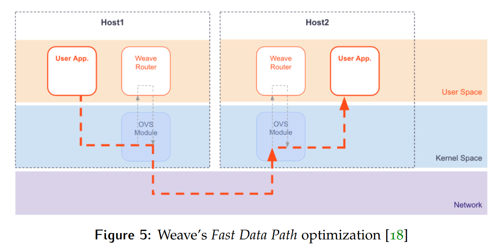

在1.2版本之前，Weave使用自定义格式封装数据包。但是，为了使内核能够路由数据包，使用VXLAN(在下面的3.3节中有更详细的解释)进行封装。在撰写本文时，Fast Data Path还不支持加密。

#### 3.2.3 Flannel 

Flannel是作为CoreOS的一个组件开发的，最初是为Kubernetes设计的，Kubernetes是谷歌设计的一个开源容器集群管理器，用于具有大量容器的大型环境。与Weave解决方案不同，Flannel不与libnetwork集成，也不部署单独的容器实例。相反，它创建一个守护进程(flanneld)在每个容器主机上。这个后台进程控制Overlay网络。

为了同步所有的服务，Flannel需要etcd KV-store，它也是作为CoreOS的一个组件创建的，存储了一些重要的信息，比如虚拟容器IP地址和主机地址之间的映射以及用户定义的子网。另一个必须在KV-store中进行的重要配置是通过Open vSwitch进行VXLAN转发。否则，Flannel使用UDP隧道，这大大降低了网络性能。这个项目中使用的配置见清单3.1：

旦一个主机加入到覆盖网络Flannel自动分配一个随机挑选的子网(/24默认)，Docker可以从中分配IP地址到各个容器。

为了将选中的子网分配给主机，Flannel尝试更新etcd store中的Overlay网络配置。如果子网已经分配给另一个主机，更新将失败，Flannel将选择另一个子网。如果子网仍然可用，Flannel将获得一个24小时的租约，该租约将在到期前一小时延长。为了正确地路由包，Flannel跟踪etcd商店/coreos.com/network/subnets位置的所有条目,并使用此信息来维护自己的路由表。在未来，Flannel计划使用IPsec来支持IP包的认证和加密。

### 3.3 VXLAN

尽管所有讨论的Docker overlay网络都使用不同的方式连接跨越多个主机Docker容器，它们都使用了VXLAN协议。该协议对所讨论的overlay网络的性能具有重要意义。

VXLAN通过VXLAN Tunnel Endpoints (VTEP)连接到VM, VTEP位于存放VM的管理程序中。因此，VM不知道VXLAN隧道。VXLAN用于连接Docker容器而不是VMs, vtep位于Docker Engine。VTEPs可以通过它们的MAC地址和VNI的组合来唯一地识别。

封装大大增加了包处理的工作量。它为一个mtu大小的包的处理增加了21%的CPU周期，导致吞吐量损失31.8%，延迟增加32.5%。些网络接口控制器(NIC)可以接管一些工作负载，从而减轻CPU的负担，从而提高覆盖网络的性能。

## 3.4 géant testbed services 

GEANT是横跨整个欧洲的欧洲研究和教育网络。GEANT测试台服务(GTS)连接了该网络的五个站点，并提供了在比internet更可控的环境中大规模创建地理上分散的实验网络的能力。这项服务允许实验人员定义他们自己的现实和灵活的网络拓扑。在图7中可以看到体系结构的高级概述：

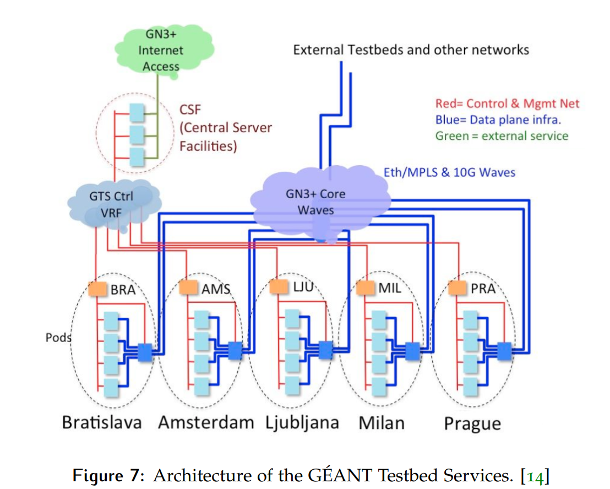

这些站点通过10Gbps的专用点对点光波线路连接。每个站点都由几个物理机器组成，这些机器在测试床需要vm时分配它们，并在测试床结束时释放它们。试验台通信通过数据平面基础设施传输。控制和管理网络用于维护如安装软件或各种配置。互联网接入网关(IAGW)为实验人员提供了从外部服务器加载自己的软件的可能性。

GTS自己的领域特定语言(DSL)用于描述如何组合资源(如vm、虚拟电路、OpenFlow交换机和外部域)来创建用户定义的网络。此外，DSL还可以用来指定某些参数，比如VM的磁盘大小、链接的容量或端口的方向性。然而，并不是GTS手册中描述的所有功能都是完全可用的。

一旦指定了拓扑，就会动态地分配资源。Ubuntu 14.04 LTS KVM虚拟主机会被部署。允许直接和完全访问物理主机的网络接口控制器(NIC)。

无法指定分配VM的物理主机。因此，不能保证同一位置上的两个vm在同一物理主机上运行。然而，根据GTS团队，VM的网络性能保证对所有物理机器都是一样的。尽管测试床在设计上是隔离的，但是数据平面基础结构的带宽是共享的，并且可能会干扰其他用户。

Hermans和de Niet[3]的研究表明，在GTS中不存在昼夜循环。这一发现，加上他们检测到的少量抖动，使他们得出结论，几乎没有同时使用GTS。

在这个项目中，GTS更新到了3.1版。新版本主要介绍了安全性和可用性方面的改进。现在通过TLS保护与GTS服务的HTTP通信，密码使用bcrypt加密，GUI中的维护标志警告用户正在进行的维护和受限的用户访问。此外，还提高了GUI中资源的保留和激活以及测试视图的性能。

## 4 方法论

为了研究这两个研究问题，在GTS中进行了必要的实验。我为每个研究问题使用了不同的拓扑。这些拓扑是用类似json的DSL格式定义的。清单4.1是这样一个DSL规范的示例，它定义了Amsterdam和Bratislava之间的简单点拓扑。

GTS拓扑是动态供应的，但在整个保留期间保持静态，这意味着它们不能被修改。相反，vm需要重新配置时必须创建一个新的拓扑。默认情况下，所有vm都提供了一个eth0接口。该接口连接到控制和维护网络，通过该网络可以管理vm。它不应该用于测试，因为它与DSL创建的拓扑无关。数据平面基础结构的接口(由DSL中主机对象的port属性定义)需要手动配置。在编写本文时，这个配置不能由GTS本身完成，因为它不支持端口映射。未来的版本将允许在GTS GUI中进行这种配置。清单4.2显示了如何配置一个IP地址为10.10.10.10的新eth1接口。拓扑中的其他vm需要使用相同范围内的IP地址（10.10.10.x）进行配置。将配置写入/etc/network/interfaces将使更改永久不变，并确保在重新启动VM后它们仍然是活动的。

### 4.1 部署考虑

在研究过程中，Hermans和de Niet创建了GitHub存储库1，其中包括安装Docker的脚本和可选的第三方覆盖网络。此外，它配置Flannel overlay使用VXLAN，这是不被默认使用。由于Docker的本地覆盖驱动程序需要3.16或更高的内核版本，该脚本还会从版本更新VMs内核3.13到3.19。因为我的研究是基于他们的工作，所以我使用这些脚本来设置测试环境。

libnetwork覆盖网络的配置不是通过引导脚本完成的。这可以很容易地手动设置。和Flannel一样，libnetwork也需要一个kv库来存储关于网络状态的信息。因为Flannel 特别需要一个etcd的KV-store，这个为了维护一致的环境，libnetwork还选择了etcd。启动用于libnetwork的etcd KV-store的简单脚本如清单4.3所示。它配置用于管理两个主机组成的集群。在生产模式中，此配置应该放在一个单独的文件中，以便于维护和增加灵活性。

Weave不需要单独的kv库，因为它实现了自己的机制来传播参与节点的地址。启动的Weave路由器只需要指向至少一个其他Weave路由器的地址，就可以加入overlay网络，并自动了解网络上的其他节点。

### 4.2 测量工具

为了检查覆盖网络的性能，我创建了一个定制的Dockerfile，可以在附录B中看到。这个文件指定了一个Docker容器，它非常通用，可以用于所有进行的实验。它基于Ubuntu 14.04映像，并安装了必要的基准测试工具iperf3和netperf。此外，它还包含Python编程语言及其用于处理和绘制实验结果的numpy和matplotlib库。此外，安装了用于修改NIC设置的ethtool实用工具，将用于不同实验的Python脚本复制到容器中，并公开必要的端口。

此外，我使用了stress-ng工具，它提供了各种不同的方法来street CPU，以生成额外的CPU工作负载。构建并部署Docker容器，如清单4.4所示：

docker构建命令下载Ubuntu映像并添加额外的层来创建一个名为gtsperf的docker映像。然后，通过Docker run命令将此映像的实例作为Docker容器启动。特权选项授予容器特殊的权限。这对于ethtool工具的正确运行是至关重要的。为了更好地了解VM的资源使用情况，使用了cAdvisor。该工具启动一个Docker容器，该容器收集并可视化有关正在运行的容器的信息。它报告每个容器的资源使用情况以及主机上的总体资源使用情况。

### 4.3 实验设计

由于这两个研究问题需要不同的拓扑，所以每个问题都使用了专用的测试平台。为了获得真实的结果，一次只运行一个测试，以避免同时运行测试可能导致的伪造结果。**iperf3和netperf的所有测量都运行两分钟。这些测量重复20次以平衡异常值。**所有的实验都是由一组具有不同参数值的测量值组成的，以检查该参数如何影响性能。

对于每个实验，我都编写了一个专用的Python脚本，它执行测量并将20次迭代的结果写入磁盘。在实验结束时，这些数据被绘制成条形图，以显示结果的平均值和标准差。事实上，数据在绘制之前就被写到磁盘上，这使得调整结果图更加容易。由于这些脚本运行多达10个小时，所以它们将它们的进度写入日志文件，以帮助监视它们的执行。

由于实验结构相似，专用脚本也非常相似。

#### 4.3.1 实验1:UDP和TCP吞吐量

为了检查低UDP吞吐量和高TCP吞吐量之间差异的原因，创建了四个单独的点对点连接的拓扑(参见图8)。

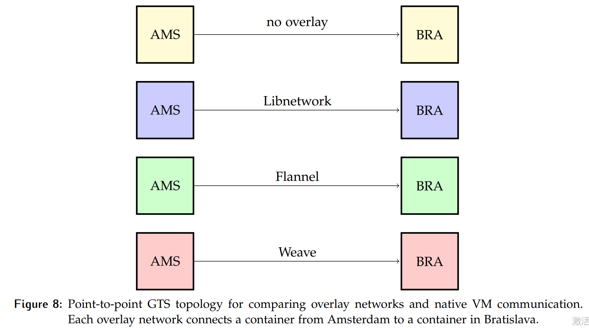

第一个连接上的vm不托管任何Docker容器。

##### 吞吐量和CPU使用之间的相关性

Claassen[1]和Hermans & de Niet[3]假设在覆盖网络中观察到的低UDP吞吐量是由iperf执行的CPU密集型抖动测量造成的。这个假设是通过一系列的实验来研究吞吐量和CPU使用之间的相关性。首先，在所有连接上运行UDP和TCP吞吐量测量，同时使用cadvisor监视CPU使用情况。**本实验阐明了在何种情况下吞吐量受CPU容量的限制**。用于这些度量的iperf3命令如清单4.5所示，这些是没有特殊标志的基本测量。

**下一个实验研究UDP和TCP吞吐量如何受到有限的CPU容量的影响**。第一个想法是创建现有拓扑的第二个版本，其中一个较低CPU容量分配给主机。但是，即使在DSL中指定一个主机的CPU容量选项在GTS手册[14]中有提到，它对分配的vm没有任何影响。相反，选择stress-ng来生成不同强度的额外CPU工作负载。该工具提供了广泛的选项来控制应该以何种方式强调哪些资源。其中一个选项控制应该占用的CPU容量的百分比。这个选项实际上用处不大，因为当iperf3占用100%的CPU容量时，它不会创建任何额外的工作负载。显然，stress-ng发现CPU已经够忙了，不需要再增加压力。于没有其他方法来控制CPU压力的强度，因此这个问题的最终解决方案是在整个测量时间的不同部分同时运行stress-ng和iperf3。这将揭示不同数量的iperf3可用CPU周期对吞吐量的影响。

##### 碎片对吞吐量的影响

UDP传输的CPU密集型任务是当数据包的总数据报大小大于接口的最大传输单元(MTU)时发生的碎片化。在这种情况下，包需要被分成更小的包，这些包可以传递给接口。标准以太网接口的MTU是1500。Docker覆盖网络的MTUs更小，因为VXLAN封装了50个字节的数据包头。此libnetwork和Flannel接口的MTU是1450字节，Weave接口的MTU更小，只有1410字节。这个实验运行清单4.6中所示的iperf3命令，使用从1000字节到2000字节不等的不同数据报大小，步长为100字节。选择这个范围是为了检查MTU大小周围数据报大小的流量吞吐量。由于碎片是相对CPU密集型的，而且CPU容量似乎是吞吐量的限制因素，所以一旦数据报超过接口的MTU，吞吐量预计会减少。

##### UDP和TCP offload的影响

如第9页3.3节所述，一些nic有能力接管CPU密集型任务，如UDP碎片和TCP分段。ethtool工具能够查看NIC的卸载功能，并且能够启用或禁用某些类型的卸载(如果NIC支持的话)。由于UDP和TCP卸载减轻了CPU的负担，所以这种优化可以对吞吐量产生积极的影响。这个实验通过运行iperf3和卸载来检验这个假设。

对于UDP卸载，随着UDP数据报碎片化程度的增加，影响将变得更加显著。因此，将生成数据报大小在≈1400和≈10000字节之间的UDP流量。由于接口的mtu不同，VM和不同的覆盖网络具有不同的碎片化阈值。为了公平地比较吞吐量，在实验期间增加数据报大小的步长取决于接口的MTU。

用于控制TCP分段卸载和UDP分段卸载的ethtool命令如清单4.7所示：

#### 4.3.2 实验2:Weave的多跳路由

二个研究问题是Weave的跳转路由特性在吞吐量和延迟方面的性能。此测试使用的拓扑如图9所示：

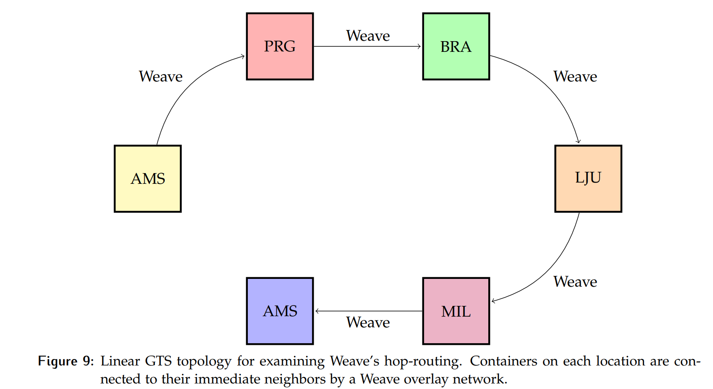

由6个地理上分散的主机组成，由5个网络段连接。每个主机只与它的近邻相连。在GTS级别上，每个网络段是一个单独的子网。需要注意的是，此拓扑中的vm只能与相邻的vm联系。但是，当创建一个通过在每个虚拟机上发射编织路由器，附加的Docker容器可以连接到编织覆盖网络的所有容器。编织路由器自动传播网络拓扑并学习其他参与节点的地址。

延迟实验使用netperf, netperf用于测量第一个主机上的Docker容器和其他主机上的Docker容器之间的延迟。因此，netperf客户机的一个实例运行在第一个Docker容器上，而所有其他Docker容器都运行netperf服务器的一个实例。这将得到1 - 5跳的延迟。为了比较这些结果，将它们与每个网络段的单个延迟的累积和进行比较。两个结果延迟的差异表示中间路由器造成的开销。用于测量延迟的netperf命令如清单4.8所示：

UDP和TCP吞吐量测量使用iperf3执行。实验的设置方法与延迟实验相同。它度量从第一个主机上的容器到其他五个容器的吞吐量。

## 5 结果

### 5.1 udp-tcp测试结果

#### 5.1.1 吞吐量和CPU使用率之间的相关性

结果是，启动iperf3客户端后，VM和所有Docker容器上的CPU使用率立即提高到100%，UDP和TCP测试都是如此。图10显示了cadvisor可视化的CPU利用率的屏幕截图。它清楚地说明了在iperf3客户机启动时，CPU使用率如何达到100%。这表明，吞吐量的瓶颈实际上是CPU容量。

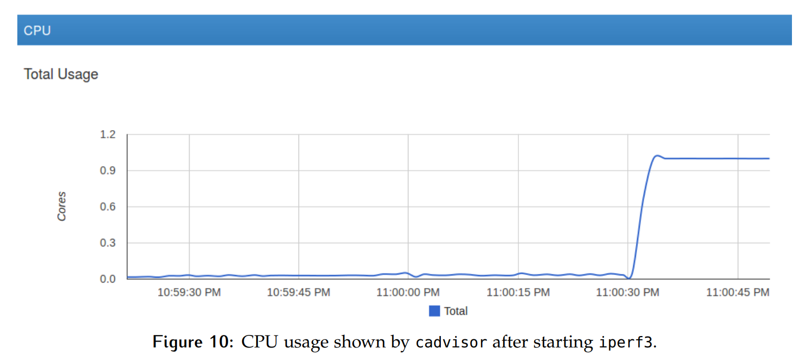

图11显示可视化的实验结果，检查额外的CPU工作负载对TCP和UDP吞吐量的影响。正如预期的那样，增加CPU上的额外工作负载，从而减少iperf3可用的CPU周期数量，这会降低TCP吞吐量：

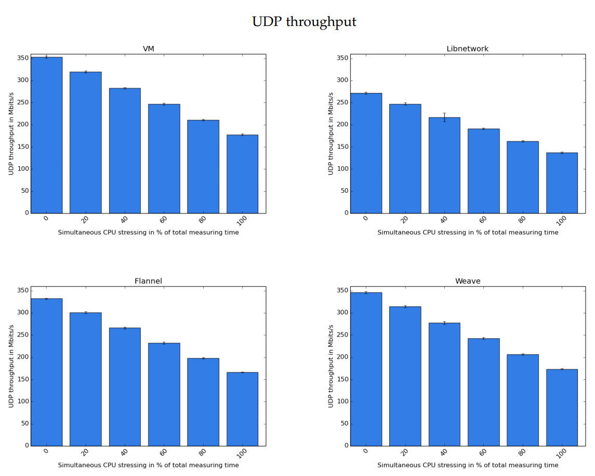

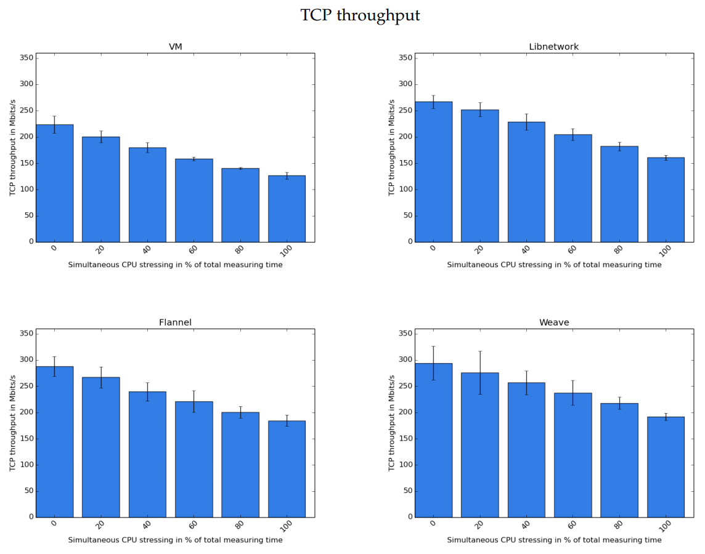

#### 5.1.2 分片的影响

图12清楚地显示了数据报碎片对吞吐量的影响：

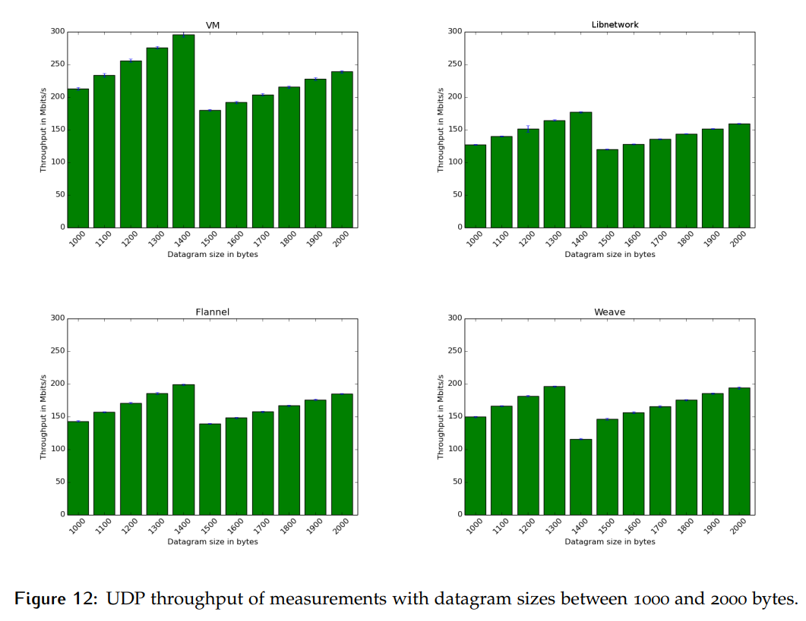

一旦数据报的大小超过了网络的MTU大小，由于分片，吞吐量就会下降≈30%。将数据分解并将结果片段封装到数据报的过程非常耗费CPU，因此会显著降低吞吐量。当比较Weave overlay和其他三个plot时，破碎阈值取决于MTU的事实变得更加明显。如前所述，Weave接口的MTU是所有覆盖中最低的，只有1410字节。因此,1400字节的数据报封装在一个VXLAN包超过了MTU和需要分片。libnetwork和Flannel 不需要分片就可以传输1400字节的数据报，因为它们的MTU更大。

此外，结果表明，只要不发生碎片，较大的数据报大小就可以提供更高的吞吐量。

#### 5.1.3 offloading的影响

ethtool可以列出在VM上启用了哪些类型的卸载，但是不能修改NIC设置。UDP和TCP卸载在VM上都是禁用的。令人惊讶的是，在这些vm上运行的Docker容器上默认启用了卸载。因此，即使vm本身不支持卸载，Docker容器也支持卸载。此外，ethtool可以在Docker容器中修改这些NIC设置。UDP吞吐量的结果如图13所示：

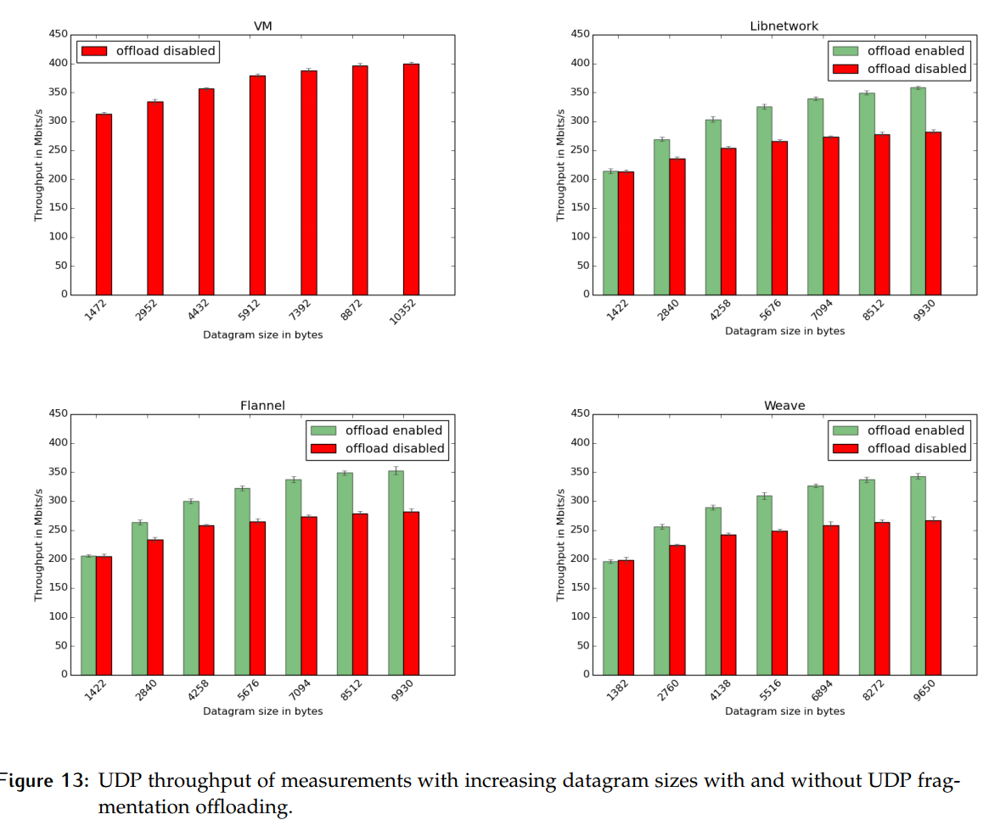

比较VM的吞吐量和没有offload的覆盖，可以发现VXLAN封装造成的开销。这些结果与之前的研究结果一致，即VXLAN封装降低了31.8%的吞吐量。这一损失的一部分可以被UDP卸载吸收，这对吞吐量有积极的影响。正如预期的那样，卸载的影响随着碎片化程度的增加而增加。然而，即使对于大的数据报，VM的吞吐量仍然超过覆盖网络的吞吐量。

另一个有趣的结果是，在更大的范围内增加数据报的大小会增加吞吐量，即使碎片的程度也会增加。这也解释了为什么使用iperf3（默认128MB）的UDP测量比Hermans和de Niet执行的iperf（默认1470 B）测量获得更高的吞吐量。

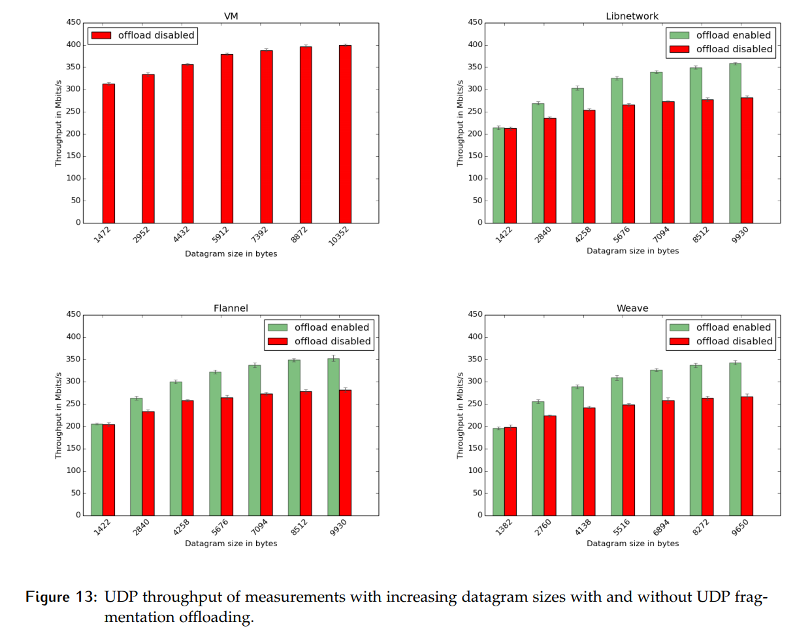

如图14所示：

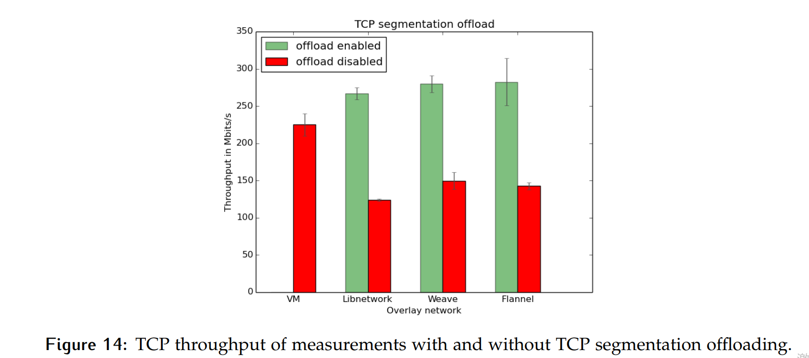

TCP吞吐量也受到VXLAN封装开销的影响。没有分段卸载的覆盖网络的吞吐量明显低于虚拟机的吞吐量。这些结果与UDP结果相似，因为吞吐量也降低了≈30%。然而，卸载的积极影响似乎对TCP吞吐量有更大的影响。结果表明，这种优化几乎使TCP吞吐量翻了一番，因此到目前为止它的吞吐量超过了VM的吞吐量。

### 5.2 weave的多跳路由测试结果

Docker容器通过多个跃点进行通信的线性编织覆盖网络的配置被证明是相当简单的。织路由器只需要提供其近邻的地址，就可以直接与多跳之外的Docker容器通信。此外，如图15所示，在跨多个跃点路由数据时不会引入额外的延迟：

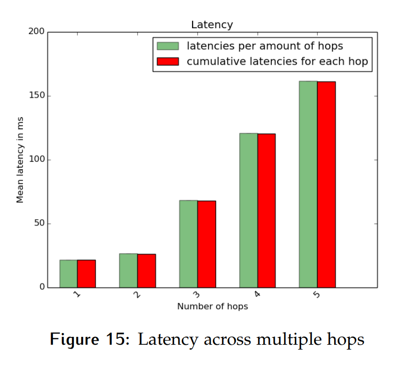

对于每个跳数，总延迟等于每个网络段测量的单个延迟的累积和。该图还表明延迟没有变化。

在吞吐量测量期间，一些编织路由器偶尔停止使用快速数据路径优化，如图5所示。

并回落到sleeve模式，大大降低了吞吐量。这个问题在早期的实验中从未发生过。根据Weave开发者的说法，在默认情况下总是使用快速数据路径，只有当Weave路由器启动时带有相应的flag时，才会禁用快速数据路径。由于重新启用快速数据路径的惟一方法是重新启动Weave路由器，所以它无法使用专用的Python脚本测量吞吐量。相反，测量是通过在Docker容器内手动执行5次iperf3命令并在必要时重新启动编织路由器来进行的。由于时间的限制，这些测量没有重复20次，就像这个项目的其他实验一样。得到的结果如图16所示：

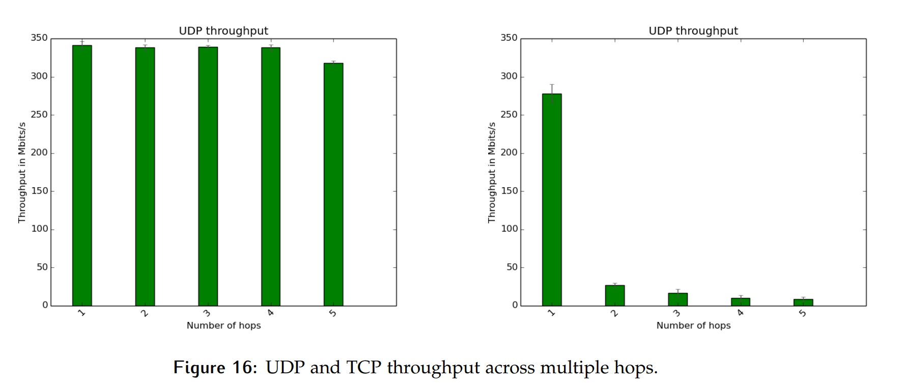

TCP吞吐量在第一跳之后意外地显著下降，然后随着每一跳的增加而略微下降。这个结果是特别令人惊讶的，当它与UDP吞吐量的结果比较，UDP几乎不受路由跨多个跃点影响。这种未预料到的行为的原因将是一个值得进一步研究的有趣话题。

## 6 讨论

### 6.1 Overlay可用性

在设置和执行不同覆盖解决方案的实验期间，我有机会评估不同覆盖解决方案的可用性。我发现Weave是最容易安装和维护的。事实上，编织不需要单独安装共享网络状态的KV-store使得部署非常简单。跳路由功能允许不直接连接的编织路由器之间通信。此外，在这三种覆盖解决方案中，Weave是唯一支持加密的。

由于libnetwork内置在Docker中，所以不需要单独安装。与其他两个覆盖网络相比，它能够容纳多个覆盖网络和一个主机上共存的本地网络。

另一个缺点是需要显式地激活VXLAN，这对于达到其他两个网络覆盖的性能是必要的。此外，Docker容器在启动时自动连接到Flannel 覆盖网络。这在设置测试环境时被证明是有用的，但是当某些容器的隔离非常重要时可能会导致问题。

从本质上讲，libnetwork似乎对于较小的静态拓扑非常有用，在这种拓扑中，很少需要重新配置网络状态。对于需要多个隔离覆盖网络的拓扑，此解决方案也是正确的选择。Weave适用于经常变化的复杂拓扑，因为Weave可以自动传播当前网络状态，无需重新配置。由于Flannel 的设置更加复杂，并且没有提供libnetwork或Weave没有覆盖的任何特性，所以我认为法兰绒overlay网络比其他解决方案更适合任何应用。

### 6.2 udp-tcp test 

### 6.3 Weave多跳路由

跃点路由没有引入额外的延迟开销。路由跨多个跃点时，UDP吞吐量仅略有下降时。然而，TCP吞吐量在第一跳之后会急剧下降。这可能是由于TCP协议比较复杂，需要双向发送数据。另一种解释可能是TCP不能跨多个跃点协商窗口大小，这将阻止为了扩展吞吐量而增加窗口大小。

## 7 总结

首先，我调查了所有覆盖网络的UDP吞吐量显著低于VM吞吐量的原因。此外，我还探究了为什么覆盖网络的TCP吞吐量没有表现出相同的行为，但仍然与VM的TCP吞吐量一样高。