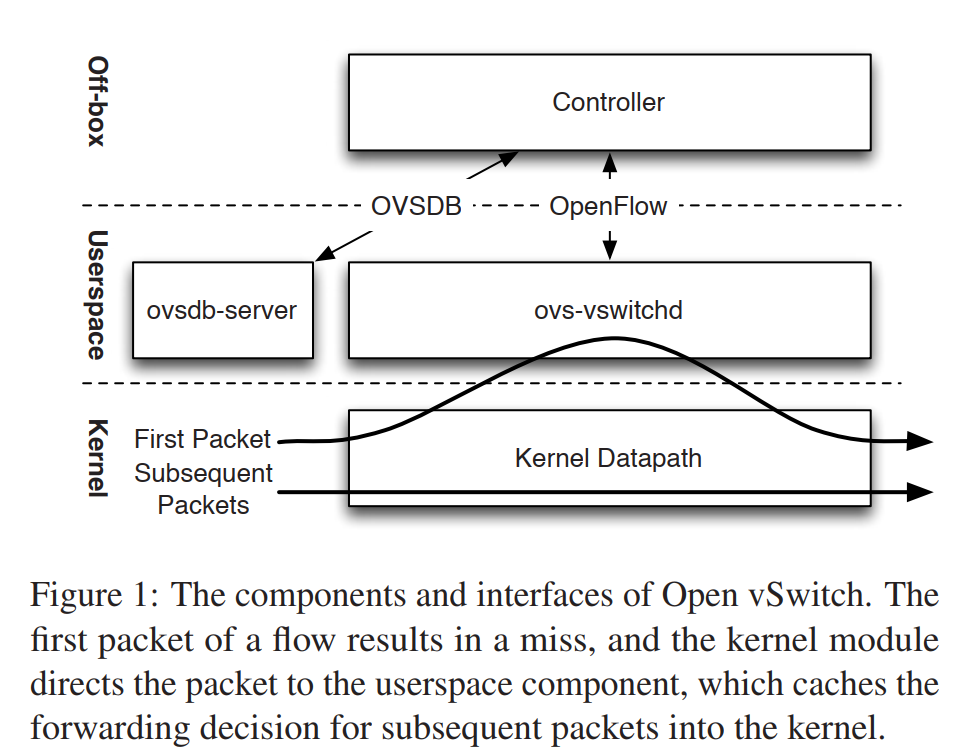
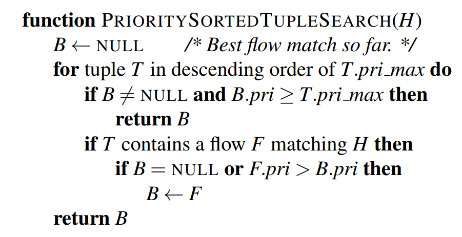

[TOC]

## 摘要

## 1 引言

设计的核心要素：性能和可编程性

支持跨平台。

本文重点阐述：how Open vSwitch obtains high performance without sacrificing generality 

## 2 设计约束和原理

Open vSwitch的分类算法的设计：解决大规模部署中转发状态不断变化

OVS因为有了3个独特的需求（Resource sharing, Placement, SDN）,它的设计和其他虚拟交换机有一些不同之处：

1. 因为OVS一开始就是个OpenFlow虚拟交换机，所以它是可编程的，和其它专用目的的虚拟交换机不同
2. OpenFlow带来了灵活性，但也导致了包的处理流水线变长，和更高的分类负载。为了防止OVS比友商消耗更多资源，它被迫实现了流缓存
3. Open vSwitch是开源和跨平台的，这迫使Open vSwitch的设计变得非常模块化和可移植性

## 3 设计

### 3.1 概览

两个指挥包转发的主要组件：

1. ovs-vswitchd ：用户态的守护进程，不同操作系统是一样的
2. datapath 内核模块 ：通常是为特定操作系统编写的，以提高性能

在内核中的datapath首先从物理网卡或VM的vNIC接收到包，这时候会有两种情况：

1. ovs-vswitchd指示了datapath如何去处理这种类型的包，这些指示称为Action。Action列出了传输数据包的物理端口或隧道，也可能会进行包修改或包采样，或者是把包丢弃掉。datapath会根据这些Action对包进行处理。
2. 当datapath没有收到ovs-vswitchd下发的Action时，它会把包发给ovs-vswitchd。ovs-vswitchd会决定怎么去处理这个包，然后把包和对该包的处理操作发会给datapath，通常还会让datapath缓存该包的Action，以处理后面类似的包

ovs-vswitchd接收SDN控制器下发的OpenFlow流表。

性能的关键方面：包分类和内核-用户空间接口

### 3.2 包分类

在通用处理器上，算法的包分类是很昂贵的，特别是在OpenFlow中。

Open vSwitch uses a **tuple space search classifier** for all of its packet classification, both kernel and userspace 。

all the flows in an Open vSwitch flow table matched on the same fields in the same way ，A tuple search classifier implements such a flow table as a single hash table. the set of fields form that hash table’s key .

If the controller then adds new flows with a different form of match, the classifier creates a second hash table that hashes on the fields matched in those flows 

With two hash tables, a search must look in both hash tables. If there are no matches, the flow table doesn’t contain a match; if there is a match in one hash table, that flow is the result; if there is a match in both, then the result is the flow with the higher priority 

As the controller continues to add more flows with new forms of match, the classifier similarly expands to include a hash
table for each unique match, and a search of the classifier must look in every hash table 

While the lookup complexity of tuple space search is far from the state of the art [8, 18, 38], it performs well with the flow tables we see in practice and has three attractive properties over decision tree classification algorithms （虽然这个算法的复杂度最优算法差很多，但它在实际应用上效果不错，而且还有3个吸引人的地方）

### 3.3 OpenFlow作为一个分类模型

在Open vSwitch中，OpenFlow用于控制快速变化而短暂的数据，如流表；而配置数据库（ovsdb-server ）用来控制更长久的状态，比如创建或销毁OpenFlow交换机，增加或删除port，配置QoS队列，关联OpenFlow控制器和switch，启用或禁用STP。

## 4 流缓冲设计

### 4.1 Microflow缓冲

在2007年，为了取得好的性能，最初的实现把所有的包处理都放到内核模块中处理。这个方法很快就变得不可行，因为开发，部署，升级内核模块不是一件容易的事。

我们的解决方案是重新设计内核模块作为一个microflow cache，这个cache里单个表现就可以匹配该包的所有头。性能的关键瓶颈在于flow setup time:内核报告一个miss包给用户空间到用户空间回复的时间。

将一起到达的miss包批量处理，减少系统调用，提升了大约24%的setup性能。

将setup的负载分发到多个线程，利用多核CPU的优势。

### 4.2 Megaflow缓冲

Megaflow流表表示所有用户空间OpenFlow流表的向量积的一个活跃子集。Megaflow cache是一个单独的流查找表。

microflow cache 在大量短声明周期连接的场景下性能有严重的下降。在这种场景下，miss包不仅需要跨越内核-用户空间，还需要执行一系列开销昂贵的包分类操作。我们用Megaflow替代的microflow。

即使它缺乏对流优先级的支持，但是一个megaflow查找的成本接近通用数据包分类器。OVS通过保留microflow作为一级cache来解决这个问题。除了每个流的第一个包外，该流后面的包都可以快速地找到相应的Meagflow。

## 5 Caching-aware Packet Classification 

本节是对3.2的包分类算法的优化。

### 5.2 元组的优先级排序

Lookup in a tuple space search classifier ordinarily requires searching every tuple. Even if a search of an early tuple finds a match, the search must still look in the other tuples because one of them might contain a matching flow with a higher priority. 

We improved on this by tracking, in each tuple T, the maximum priority T.pri_max of any flow entry in T. We modified the lookup code to search tuples from greatest to least maximum priority, so that a search that finds a matching flow F with priority F.pri can terminate as soon as it arrives at a tuple whose maximum priority is F.pri or less, since at that point no better match can be found. (每个元组T中保存该元组中所有流最高的优先级T.pri_max，当一个搜索找到一个匹配的流，并且发现该元组的F.pri_max小于或等于该匹配流的优先级后，则可以结束查找了)

### 5.3 Staged Lookup 

The solution we implemented statically divides fields into four groups, in decreasing order of traffic granularity: metadata (e.g., the switch ingress port), L2, L3, and L4. We changed each tuple from a single hash table to an array of four hash tables, called stages: one over metadata fields only, one over metadata and L2 fields, one over metadata, L2, and L3 fields, and one over all fields. 

We divided fields by protocol layer because,as a rule of thumb, in TCP/IP, inner layer headers tend to be more diverse than outer layer headers. At L4, for example, the TCP source and destination ports change on a per-connection basis, but in the metadata layer only a relatively small and static number of ingress ports exist 

## Points

Algorithmic packet classification is expensive on general
purpose processors, and packet classification in the context of OpenFlow is especially costly because of the generality of the form of the match, which may test any combination of Ethernet addresses, IPv4 and IPv6 addresses,
TCP and UDP ports, and many other fields, including
packet metadata such as the switch ingress port. 