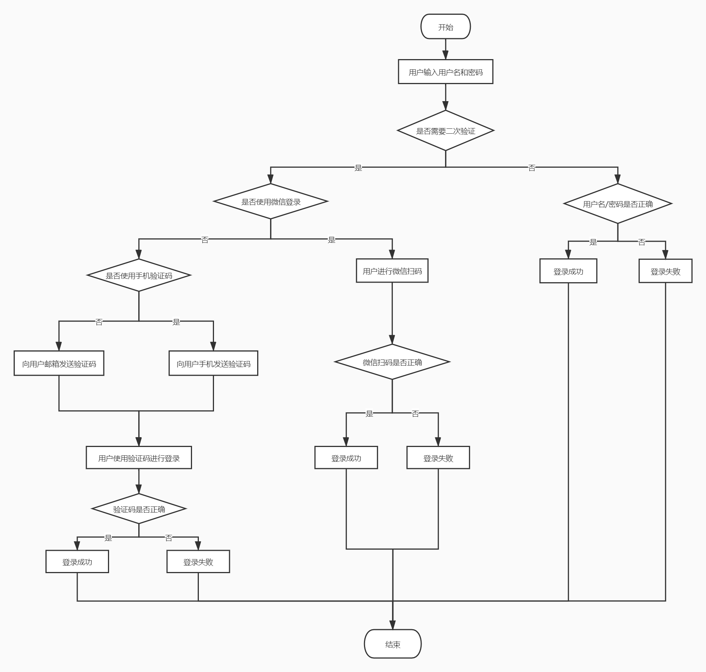
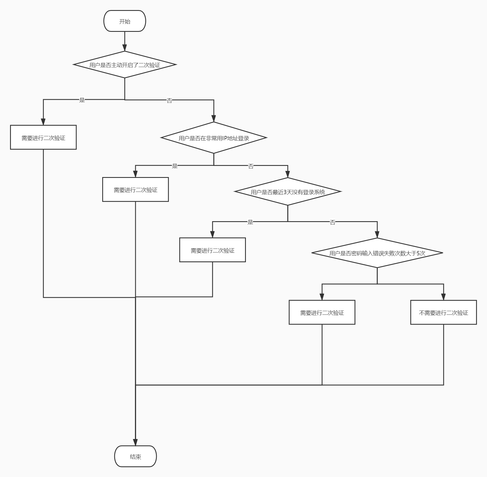

[TOC]

# 描述

主要有两个方面的要点：

1. 何时需要进行二次验证
2. 如何实现二次验证

## 何时需要进行二次验证

出现以下情况之一，则不能直接使用密码登录，需要进行二次验证：

1. 使用不常用的IP地址登录的
2. 使用密码登录失败尝试次数过多的（大于5次）
3. 用户主动设置禁用密码登录的
4. 距离上次登录成功时间过久的（大于7天）

## 如何实现二次验证

用户在登录时，前端需要先向后端发起一次请求，判断该用户是否需要二次验证，流程图如下：



判断是否需要二次验证流程：




### 数据库表设计

#### login_security_enhancement

用于保存用户是否需要二次验证的判断依据信息。


#### shouji/email_verification_code


userName防止验证码被其他用户使用，type防止一个验证码被用于多个操作。同个用户同个type的验证码只保存一条，重复发送会覆盖之前的记录。

已有的和验证码相关的表：

user_verification


telephone_verify


### 验证码登录实现

修改GenerateShortTermTokenByName的实现，首先判断用户能不能用密码登录，可以用的话使用原来的逻辑，否则需要从请求数据中拿到code进行校验。

使用密码登录前端需要传过来的请求数据：

```json
{
    "username": "{{USER1}}",
    "password": "{{PASS1}}"
}
```

使用验证码登录前端需要传过来的请求数据：

```json
{
    "username": "{{USER1}}",
    "verification_code": "320129"
}
```


验证码认证模块主要实现两个功能：发送验证码，校验验证码

#### SendVerificationCode

```go
func SendVerificationCode(userName string, codeType int, isByEmail bool, target string) string, error
```

参数说明：

- userName : 用户名
- codeType : 验证类型，如登录验证、绑定邮箱验证、绑定手机验证等
- isByEmail ：指定是向邮箱还是手机发送验证码
- target：邮箱号或手机号

该方法会生成验证码，并向target发送验证码，发送成功向verification_code表写入相关信息，并返回验证码，发送失败返回error。


#### ValidateVerificationCode

```go
func ValidateVerificationCode(userName string, codeType int, code string) bool 
```

参数说明：

- userName：用户名
- codeType ：验证类型
- code ： 验证码

验证码有效返回true，无效返回false。


